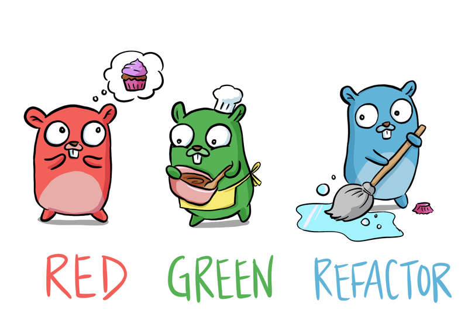

# Введение в приемочные испытания



1

1

1

В компании $WORK мы столкнулись с необходимостью "плавного завершения работы" наших сервисов. Грациозное завершение работы позволяет убедиться в том, что система правильно завершает свою работу перед завершением работы. В качестве аналогии можно привести ситуацию, когда человек пытается правильно завершить телефонный разговор перед тем, как перейти к следующей встрече, а не просто бросает трубку на середине фразы.
В этой главе мы расскажем о том, что такое плавное завершение работы в контексте HTTP-сервера, а также о том, как писать "приемочные тесты", чтобы быть уверенным в поведении своего кода.
После прочтения этой главы вы будете знать, как совместно использовать пакеты с отличными тестами, сократить усилия по сопровождению и повысить уверенность в качестве своей работы.

## Достаточно информации о Kubernetes

Мы запускаем наше программное обеспечение на Kubernetes (K8s). K8s завершает "pods" (на практике - наше программное обеспечение) по разным причинам, и одна из них - когда мы выкладываем новый код, который хотим развернуть.
Мы устанавливаем для себя высокие стандарты в отношении [метрик DORA](https://cloud.google.com/blog/products/devops-sre/using-the-four-keys-to-measure-your-devops-performance), поэтому работаем так, что небольшие, инкрементные улучшения и возможности внедряются в производство несколько раз в день.
Когда k8s хочет завершить работу pod, он инициирует ["жизненный цикл завершения"](https://cloud.google.com/blog/products/containers-kubernetes/kubernetes-best-practices-terminating-with-grace), частью которого является отправка сигнала `SIGTERM` нашему программному обеспечению. Это означает, что k8s сообщает нашему коду:

> Ты должен выключиться, закончить всю работу, которую ты делаешь, потому что после определенного "льготного периода" я пошлю `SIGKILL`, и для тебя наступит конец света.

По сигналу `SIGKILL` любая работа, которую выполняла ваша программа, будет немедленно остановлена.

## Если у вас нет благодати

В зависимости от характера вашего программного обеспечения, если вы игнорируете `SIGTERM`, вы можете столкнуться с проблемами.
Наша конкретная проблема была связана с летящими HTTP-запросами. Когда автоматизированное тестирование выполняло наш API, если k8s решал остановить pod, сервер умирал, тест не получал ответа от сервера, и тест завершался неудачей.
Это вызовет оповещение в нашем канале инцидентов, которое потребует от разработчика прекратить работу и устранить проблему. Такие периодические сбои являются раздражающим фактором, отвлекающим нашу команду.
Эти проблемы характерны не только для наших тестов. Если пользователь посылает запрос в вашу систему, а процесс прерывается на полпути, то его, скорее всего, встретит HTTP-ошибка 5xx, а это совсем не то, чего вы хотите добиться.

## Когда у вас есть благодать

Мы хотим прослушать запрос `SIGTERM`, и вместо того, чтобы мгновенно убить сервер, мы хотим:

- Прекратить прослушивание дальнейших запросов
- Дать возможность завершить все текущие запросы
- Затем завершить процесс.

## Как проявить милосердие

К счастью, в Go уже есть механизм для изящного завершения работы сервера с помощью [net/http/Server.Shutdown](https://pkg.go.dev/net/http#Server.Shutdown).

> Shutdown изящно завершает работу сервера, не прерывая активных соединений. Shutdown работает следующим образом: сначала закрываются все открытые слушатели, затем закрываются все простаивающие соединения, после чего ожидается неопределенное время, пока соединения не вернутся в состояние простоя, и затем происходит отключение. Если предоставленный контекст истекает до завершения выключения, Shutdown возвращает ошибку контекста, в противном случае возвращается любая ошибка, возникшая при закрытии базового слушателя (слушателей) сервера.

Для обработки `SIGTERM` мы можем использовать [os/signal.Notify](https://pkg.go.dev/os/signal#Notify), который будет посылать все входящие сигналы на предоставленный нами канал.
Используя эти две функции из стандартной библиотеки, вы можете прослушивать `SIGTERM` и завершать работу в изящном режиме.

## Пакет Graceful Shutdown

С этой целью я написал https://pkg.go.dev/github.com/quii/go-graceful-shutdown. Он предоставляет функцию-декоратор для `*http.Server` для вызова его метода `Shutdown` при обнаружении сигнала `SIGTERM`

```go
func main() {
	httpServer := &http.Server{Addr: ":8080", Handler: http.HandlerFunc(acceptancetests.SlowHandler)}

	server := gracefulshutdown.NewServer(httpServer)

	if err := server.ListenAndServe(); err != nil {
		// this will typically happen if our responses aren't written before the ctx deadline, not much can be done
		log.Fatalf("uh oh, didnt shutdown gracefully, some responses may have been lost %v", err)
	}

	// hopefully, you'll always see this instead
	log.Println("shutdown gracefully! all responses were sent")
}
```

Специфика кода не слишком важна для данного чтения, но прежде чем продолжить, стоит бегло ознакомиться с ним.

## Тесты и петли обратной связи

Когда мы писали пакет `gracefulshutdown`, у нас были юнит-тесты, подтверждающие его правильное поведение, что дало нам уверенность в агрессивном рефакторинге. Однако мы все еще не были уверены в том, что он **действительно** работает.
Мы добавили пакет `cmd` и сделали реальную программу, использующую написанный нами пакет. Мы вручную запускали ее, отправляли ей HTTP-запрос, а затем посылали `SIGTERM`, чтобы посмотреть, что произойдет.
Инженер должен чувствовать себя неуютно при ручном тестировании. Оно скучно, не масштабируется, неточно и расточительно. Если вы пишете пакет, который собираетесь распространять, но при этом хотите сохранить его простым и дешевым для внесения изменений, ручное тестирование вам не подойдет.

## Приемочные тесты

Модульные тесты - это фантастический инструмент для бесстрашного рефакторинга, развития модульного дизайна, предотвращения регрессий и обеспечения быстрой обратной связи.
По своей природе они тестируют только небольшие части вашей системы. Обычно одних модульных тестов недостаточно для эффективной стратегии тестирования. Помните, что мы хотим, чтобы наши системы всегда были готовы к отправке. Мы не можем полагаться на ручное тестирование, поэтому нам необходим другой вид тестирования: приемочные тесты.

### Что они собой представляют?

Приемочные тесты - это своего рода "тесты черного ящика". Иногда их называют "функциональными тестами". Они должны использовать систему так, как это делал бы ее пользователь.
Термин "черный ящик" означает, что тестовый код не имеет доступа к внутренним компонентам системы, он может использовать только ее общедоступный интерфейс и делать утверждения о наблюдаемом поведении. Это означает, что они могут тестировать только систему в целом.
Это преимущество заключается в том, что тесты проверяют систему так же, как это делает пользователь, и не могут использовать никаких специальных обходных путей, которые могут сделать тест пройденным, но не доказать то, что требуется доказать. Это схоже с принципом, согласно которому файлы модульных тестов лучше размещать в отдельном тестовом пакете, например, пакет `mypkg_test`, а не пакет `mypkg`.

### Преимущества приемочных тестов

- Когда они пройдены, вы знаете, что вся ваша система ведет себя так, как вы хотите.
- Они более точны, быстры и требуют меньше усилий, чем ручное тестирование.
- При хорошем написании они выступают в качестве точной, проверенной документации по системе. Она не попадает в ловушку документации, расходящейся с реальным поведением системы.
- Никакого издевательства! Все реально.

### Потенциальные недостатки против модульных тестов

- Их написание требует больших затрат.
- Они требуют больше времени для выполнения.
- Они зависят от дизайна системы.
- В случае неудачи они обычно не позволяют выявить основную причину и могут быть сложны для отладки.
- Они не дают обратной связи о внутреннем качестве системы. Можно написать полный мусор, и все равно приемочный тест будет пройден.
- Не все сценарии могут быть реализованы на практике из-за природы "черного ящика".

По этой причине глупо полагаться только на приемочные тесты. Они не обладают многими качествами, присущими модульным тестам, и система с большим количеством приемочных тестов будет страдать от затрат на обслуживание и низкого времени публикации.

### Время публикации?

Под временем публикации понимается время, которое проходит от момента слияния коммита с основной веткой до его развертывания в продакшене. Это время может варьироваться от нескольких недель и даже месяцев для некоторых команд до нескольких минут. В компании $WORK мы ценим выводы DORA и стремимся к тому, чтобы время выполнения коммита не превышало 10 минут.
Для создания надежной системы с отличным временем публикации необходим сбалансированный подход к тестированию, который обычно описывается в терминах [пирамиды тестирования](https://martinfowler.com/articles/practical-test-pyramid.html).

## Как написать основные приемочные тесты

Как это связано с исходной проблемой? Мы только что написали пакет, и он полностью поддается модульному тестированию.
Как я уже говорил, модульные тесты не давали нам необходимой уверенности. Мы хотим быть действительно уверены в том, что пакет будет работать при интеграции с реальной, работающей программой. Мы должны иметь возможность автоматизировать ручные проверки.
Давайте посмотрим на тестовую программу:

```go
func main() {
	httpServer := &http.Server{Addr: ":8080", Handler: http.HandlerFunc(acceptancetests.SlowHandler)}

	server := gracefulshutdown.NewServer(httpServer)

	if err := server.ListenAndServe(); err != nil {
		// this will typically happen if our responses aren't written before the ctx deadline, not much can be done
		log.Fatalf("uh oh, didnt shutdown gracefully, some responses may have been lost %v", err)
	}

	// hopefully, you'll always see this instead
	log.Println("shutdown gracefully! all responses were sent")
}
```

Вы, наверное, догадались, что у `SlowHandler` есть `time.Sleep` для задержки ответа, поэтому у меня было время сделать `SIGTERM` и посмотреть, что получится. Остальное достаточно шаблонно:

- Создайте `net/http/Server`;
- Оберните его в библиотеку (см.: [паттерн Decorator](https://en.wikipedia.org/wiki/Decorator_pattern));
- Использовать обернутую версию для `ListenAndServe`.

## Высокоуровневые шаги для приемочного теста

- Создать программу
- Запустить ее (и подождать, пока она прослушает сервер на `8080`)
- Отправить HTTP-запрос на сервер
- Прежде чем сервер успеет отправить HTTP-ответ, послать `SIGTERM`.
- Проверить, получен ли ответ.

## Построение и запуск программы

```go
package acceptancetests

import (
	"fmt"
	"math/rand"
	"net"
	"os"
	"os/exec"
	"path/filepath"
	"syscall"
	"time"
)

const (
	baseBinName = "temp-testbinary"
)

func LaunchTestProgram(port string) (cleanup func(), sendInterrupt func() error, err error) {
	binName, err := buildBinary()
	if err != nil {
		return nil, nil, err
	}

	sendInterrupt, kill, err := runServer(binName, port)

	cleanup = func() {
		if kill != nil {
			kill()
		}
		os.Remove(binName)
	}

	if err != nil {
		cleanup() // even though it's not listening correctly, the program could still be running
		return nil, nil, err
	}

	return cleanup, sendInterrupt, nil
}

func buildBinary() (string, error) {
	binName := randomString(10) + "-" + baseBinName

	build := exec.Command("go", "build", "-o", binName)

	if err := build.Run(); err != nil {
		return "", fmt.Errorf("cannot build tool %s: %s", binName, err)
	}
	return binName, nil
}

func runServer(binName string, port string) (sendInterrupt func() error, kill func(), err error) {
	dir, err := os.Getwd()
	if err != nil {
		return nil, nil, err
	}

	cmdPath := filepath.Join(dir, binName)

	cmd := exec.Command(cmdPath)

	if err := cmd.Start(); err != nil {
		return nil, nil, fmt.Errorf("cannot run temp converter: %s", err)
	}

	kill = func() {
		_ = cmd.Process.Kill()
	}

	sendInterrupt = func() error {
		return cmd.Process.Signal(syscall.SIGTERM)
	}

	err = waitForServerListening(port)

	return
}

func waitForServerListening(port string) error {
	for i := 0; i < 30; i++ {
		conn, _ := net.Dial("tcp", net.JoinHostPort("localhost", port))
		if conn != nil {
			conn.Close()
			return nil
		}
		time.Sleep(100 * time.Millisecond)
	}
	return fmt.Errorf("nothing seems to be listening on localhost:%s", port)
}

func randomString(n int) string {
	var letters = []rune("abcdefghijklmnopqrstuvwxyzABCDEFGHIJKLMNOPQRSTUVWXYZ0123456789")

	s := make([]rune, n)
	for i := range s {
		s[i] = letters[rand.Intn(len(letters))]
	}
	return string(s)
}
```

Программа `LaunchTestProgram` отвечает за:

- построение программы
- запуск программы
- ожидание, пока она прослушает порт `8080`
- обеспечение функции очистки для уничтожения программы и ее удаления, чтобы по завершении тестирования мы остались в чистом состоянии
- функция прерывания, посылающая программе `SIGTERM`, чтобы мы могли проверить ее поведение.

Конечно, это не самый красивый код в мире, но достаточно обратить внимание на экспортируемую функцию `LaunchTestProgram`, неэкспортируемые функции, которые она вызывает, являются неинтересным кодовым шаблоном.
Как уже говорилось, приемочное тестирование, как правило, сложнее в настройке. Однако этот код существенно упрощает чтение кода тестирования, и часто в случае приемочных тестов после написания церемониального кода о нем можно забыть.

## Приемочный тест (тесты)

Мы хотели провести два приемочных теста для двух программ - с изящным завершением работы и без него, чтобы мы и читатели могли увидеть разницу в поведении. С помощью `LaunchTestProgram` для сборки и запуска программ довольно просто написать приемочные тесты для обеих программ, и мы получаем преимущество от повторного использования некоторых вспомогательных функций.
Вот тест для сервера с изящным завершением работы, [тест без него можно найти на GitHub](https://github.com/quii/go-graceful-shutdown/blob/main/acceptancetests/withoutgracefulshutdown/main_test.go)

```go
package main

import (
	"testing"
	"time"

	"github.com/quii/go-graceful-shutdown/acceptancetests"
	"github.com/quii/go-graceful-shutdown/assert"
)

const (
	port = "8080"
	url  = "<http://localhost:" > +port
)

func TestGracefulShutdown(t *testing.T) {
	cleanup, sendInterrupt, err := acceptancetests.LaunchTestProgram(port)
	if err != nil {
		t.Fatal(err)
	}
	t.Cleanup(cleanup)

	// just check the server works before we shut things down
	assert.CanGet(t, url)

	// fire off a request, and before it has a chance to respond send SIGTERM.
	time.AfterFunc(50*time.Millisecond, func() {
		assert.NoError(t, sendInterrupt())
	})
	// Without graceful shutdown, this would fail
	assert.CanGet(t, url)

	// after interrupt, the server should be shutdown, and no more requests will work
	assert.CantGet(t, url)
}
```

Благодаря инкапсуляции настроек, тесты являются исчерпывающими, описывают поведение и относительно просты в исполнении.
`assert.CanGet/CantGet` - это вспомогательные функции, которые я сделал для того, чтобы DRY это общее утверждение для данного набора.

```go
func CanGet(t testing.TB, url string) {
	errChan := make(chan error)

	go func() {
		res, err := http.Get(url)
		if err != nil {
			errChan <- err
			return
		}
		res.Body.Close()
		errChan <- nil
	}()

	select {
	case err := <-errChan:
		NoError(t, err)
	case <-time.After(3 * time.Second):
		t.Errorf("timed out waiting for request to %q", url)
	}
}
```

Это вызовет `GET` на `URL` в горутине, и если он ответит без ошибок в течение 3 секунд, то не произойдет сбоя. `CantGet` опускается для краткости, [но вы можете посмотреть его на GitHub здесь](https://github.com/quii/go-graceful-shutdown/blob/main/assert/assert.go#L61).
Важно еще раз отметить, что Go обладает всеми необходимыми инструментами для написания приемочных тестов "из коробки". Вам не нужен специальный фреймворк для создания приемочных тестов.

### Небольшие инвестиции с большой отдачей

С помощью этих тестов читатели могут посмотреть на примеры программ и быть уверенными в том, что пример действительно работает, а значит, они могут быть уверены в заявленных в пакете характеристиках.
Важно, что мы, как автор, получаем быструю обратную связь и огромную уверенность в том, что пакет работает в реальных условиях.

```
go test -count=1 ./...
ok  	github.com/quii/go-graceful-shutdown	0.196s
?   	github.com/quii/go-graceful-shutdown/acceptancetests	[no test files]
ok  	github.com/quii/go-graceful-shutdown/acceptancetests/withgracefulshutdown	4.785s
ok  	github.com/quii/go-graceful-shutdown/acceptancetests/withoutgracefulshutdown	2.914s
?   	github.com/quii/go-graceful-shutdown/assert	[no test files]
```

## Подведение итогов

В этой статье мы ввели приемочные тесты в ваш арсенал средств тестирования. Они оказывают неоценимую помощь, когда вы начинаете строить реальные системы, и являются важным дополнением к модульным тестам.
Характер написания приемочных тестов зависит от системы, которую вы создаете, но принципы остаются неизменными. Рассматривайте свою систему как "черный ящик". Если вы создаете веб-сайт, ваши тесты должны вести себя как пользователь, поэтому для перехода по ссылкам, заполнения форм и т.д. лучше использовать безголовый веб-браузер, например [Selenium](https://www.selenium.dev/). Для RESTful API вы будете отправлять HTTP-запросы с помощью клиента.

### Дальнейшее развитие для более сложных систем

Нетривиальные системы, как правило, не являются однопроцессными приложениями, подобными рассмотренным нами. Как правило, они зависят от других систем, например от базы данных. Для таких сценариев необходимо автоматизировать локальное окружение для тестирования. Такие инструменты, как [docker-compose](https://docs.docker.com/compose/), позволяют создавать контейнеры с окружением, необходимым для локального запуска системы.

### Следующая глава

В этой заметке приемочный тест был написан ретроспективно. Однако в книге [Growing Object-Oriented Software](http://www.growing-object-oriented-software.com/) авторы показывают, что мы можем использовать приемочные тесты в тестоориентированном подходе в качестве "северной звезды", направляющей наши усилия.
По мере усложнения систем затраты на написание и поддержку приемочных тестов могут быстро выйти из-под контроля. Существует бесчисленное множество историй о том, как команды разработчиков оказывались в затруднительном положении из-за дорогостоящих наборов приемочных тестов.
В следующей главе мы познакомимся с использованием приемочных тестов в качестве ориентира при проектировании, а также с принципами и методами управления затратами на приемочные тесты.

### Повышение качества открытых исходных текстов

Если вы пишете пакеты, которые собираетесь распространять, я бы посоветовал вам создавать простые примеры программ, демонстрирующие, что делает ваш пакет, и потратить время на создание простых и понятных приемочных тестов, чтобы придать уверенности себе и потенциальным пользователям вашей работы.
Как и в случае с тестируемыми примерами, это небольшое дополнительное усилие в работе разработчика значительно повысит доверие к вашей работе и снизит ваши затраты на ее поддержку.
