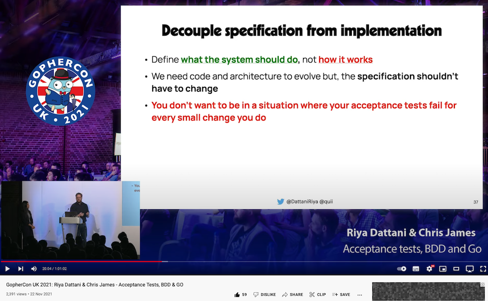
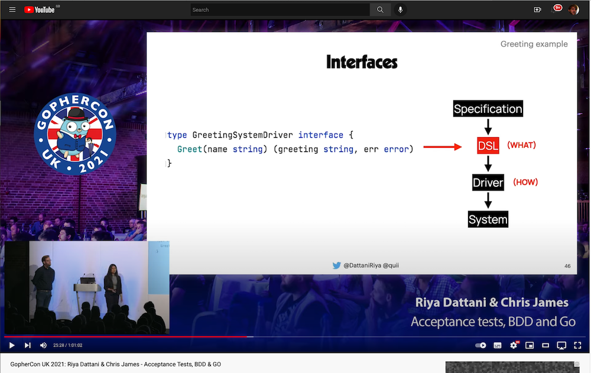
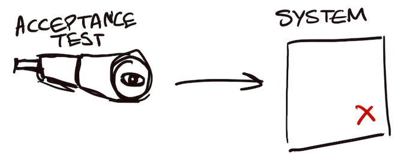
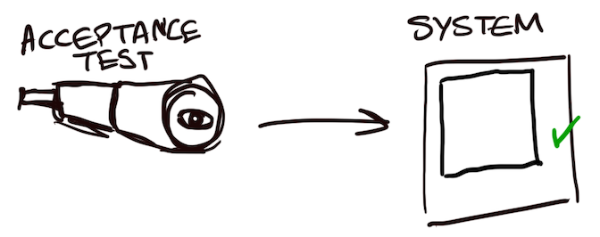
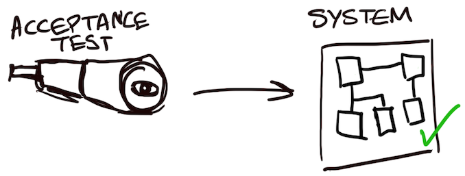

# Масштабирование приёмочных тестов

Эта глава является продолжением главы ["Введение в приёмочные тесты"](https://habr.com/ru/articles/765892/). [Готовый код](https://github.com/quii/go-specs-greet) этой главы можно найти на GitHub.

Приёмочные тесты очень важны, они напрямую влияют на вашу способность уверенно развивать систему с течением времени при разумной стоимости изменений.

Кроме того, они являются прекрасным инструментом для работы с устаревшим кодом. Если вы столкнулись с плохой кодовой базой без тестов, не поддавайтесь искушению начать рефакторинг. Вместо этого напишите несколько приёмочных тестов, которые позволят вам свободно изменять внутреннее устройство системы, не затрагивая её функциональное внешнее поведение. Приёмочные тесты не должны заботиться о внутреннем качестве, поэтому они отлично подходят для таких ситуаций.

Прочитав эту статью, вы поймете, что приёмочные тесты полезны для верификации, а также могут быть использованы в процессе разработки, помогая нам изменять систему более обдуманно и методично, сокращая напрасные усилия.

## Предварительный материал

Вдохновением для написания этой главы послужило многолетнее разочарование в приёмочных тестах. Я рекомендую вам посмотреть два видеофильма:

- Dave Farley - [How to write acceptance tests](https://www.youtube.com/watch?v=JDD5EEJgpHU)
- Nat Pryce - [E2E functional tests that can run in milliseconds](https://www.youtube.com/watch?v=Fk4rCn4YLLU)

"Growing Object Oriented Software" (GOOS) - очень важная книга для многих разработчиков программного обеспечения, в том числе и для меня. Подход, прописанный в ней, - это тот подход, которому я обучаю инженеров, с которыми работаю.

- [GOOS](http://www.growing-object-oriented-software.com/) - Nat Pryce & Steve Freeman

Наконец, мы с Рией Даттани ([Riya Dattani](https://twitter.com/dattaniriya)) затронули эту тему в контексте BDD в нашем докладе ["Приёмочные тесты, BDD и Go"](https://www.youtube.com/watch?v=ZMWJCk_0WrY).

## Напомним, что

Мы говорим о тестах "чёрного ящика", которые проверяют, что ваша система ведёт себя так, как ожидается извне, с **"точки зрения бизнеса"**. Тесты не имеют доступа к внутренностям тестируемой системы; их интересует только то, **что** делает ваша система, а не то, **как** она это делает.

## Анатомия плохих приёмочных тестов

На протяжении многих лет я работал в нескольких компаниях и командах. Каждая из них признавала необходимость приёмочных тестов - некий способ проверить систему с точки зрения пользователя и убедиться, что она работает так, как задумано, но почти без исключения стоимость этих тестов становилась настоящей проблемой для команды.

- Медленный запуск
- Хрупкие
- Нестабильные
- Дорогие в обслуживании и, похоже, делают изменение программного обеспечения более сложным, чем следовало бы.
- Могут работать только в определенном окружении, что приводит к медленным и плохим циклам обратной связи.

Допустим, вы собираетесь написать приёмочное тестирование для создаваемого вами сайта. Вы решили использовать безголовый веб-браузер (например, [Selenium](https://www.selenium.dev/)) для имитации нажатия пользователем кнопок на вашем сайте, чтобы убедиться, что он выполняет то, что должен.

Со временем разметка сайта должна меняться, поскольку появляются новые возможности, а инженеры в миллиардный раз обсуждают, должно ли что-то быть `<article>` или `<section>`.

Даже если ваша команда вносит лишь незначительные изменения в систему, едва заметные для реального пользователя, вы тратите уйму времени на обновление приёмочных тестов.

### Жесткая связь

Подумайте, что побуждает приёмочные тесты к изменениям:

- Внешнее изменение поведения. Если вы хотите изменить то, что делает система, изменение набора приёмочных тестов кажется разумным, если не желательным.
- Изменение деталей реализации / рефакторинг. В идеале это не должно побуждать к изменениям, а если и побуждает, то незначительным.

Однако слишком часто именно последнее становится причиной изменения приёмочных тестов. Доходит до того, что инженеры даже не хотят менять свою систему из-за предполагаемых усилий по обновлению тестов!



Эти проблемы возникают из-за неприменения устоявшихся и практикуемых инженерных привычек, о которых писали вышеупомянутые авторы. **Нельзя писать приёмочные тесты как модульные тесты**; они требуют более глубокого осмысления и иной практики.

## Анатомия хороших приёмочных тестов

Если мы хотим, чтобы приёмочные тесты менялись только при изменении поведения, а не деталей реализации, то вполне логично, что нам необходимо разделить эти проблемы.

### О типах сложности

Как инженеры-программисты, мы имеем дело с двумя видами сложности.

- **Случайная сложность** - это сложность, с которой нам приходится иметь дело, поскольку мы работаем с компьютерами, с такими вещами, как сети, диски, API и т.д.
- **Существенную сложность** иногда называют "логикой домена". Это особые правила и истины в рамках вашего домена.
  - Например, "если владелец счета снимает больше денег, чем есть в наличии, то это означает, что у него овердрафт". Это утверждение ничего не говорит о компьютерах; оно было верно ещё до того, как компьютеры стали использоваться в банках!

Существенная сложность должна быть понятна нетехническому человеку, и очень ценно, что она смоделирована в нашем "доменном" коде и в наших приёмочных тестах.

### Разделение проблем

То, что предложил Дэйв Фарли в предыдущем видеоролике и что мы с Рией также обсуждали, заключается в том, что у нас должна быть идея **спецификаций**. Спецификации описывают поведение системы, которое мы хотим получить, не будучи связанными со случайной сложностью или деталями реализации.

Эта идея должна казаться вам разумной. В производственном коде мы часто стремимся разделить проблемы и отделить единицы работы. Вы бы не задумываясь ввели интерфейс, позволяющий обработчику HTTP отделить его от не-HTTP-задач? Давайте применим эту же схему к нашим приёмочным тестам.

Дэйв Фарли описывает конкретную структуру.


На GopherconUK мы с Рией выразили это в терминах Go.



### Тестирование на стероидах

Отделение способа выполнения спецификации позволяет нам повторно использовать её в различных сценариях. Мы можем:

**Сделать наши драйверы конфигурируемыми**

Это означает, что вы можете запускать свои приёмочные тесты локально, в своей тестовой и (в идеале) производственной среде.

- Слишком многие команды проектируют свои системы таким образом, что приёмочные тесты невозможно запустить локально. Это создаёт невыносимо медленный цикл обратной связи. Не лучше ли быть уверенным в том, что тесты пройдут, ещё до интеграции кода? Если тесты начнут ломаться, допустимо ли, что вы не сможете воспроизвести сбой локально и вместо этого будете вынуждены фиксировать изменения и скрещивать пальцы, что они пройдут через 20 минут в другой среде?
- Помните, что если тесты проходят в staging, это ещё не значит, что система будет работать. Паритет Dev/Prod - это, в лучшем случае, белая ложь. [Я тестирую в prod](https://increment.com/testing/i-test-in-production/).
- Всегда есть различия между окружениями, которые могут повлиять на _поведение_ вашей системы. У CDN могут быть неправильно установлены некоторые заголовки кэша; сервис, от которого вы зависите, может вести себя по-другому; значение конфигурации может быть неверным. Но разве не было бы здорово, если бы вы могли запускать свои спецификации в prod, чтобы быстро обнаружить эти проблемы?

**Подключение _различных_ драйверов для тестирования других частей системы**

Такая гибкость позволяет тестировать поведение на различных уровнях абстракции и архитектуры, что даёт возможность проводить более целенаправленные тесты, не ограничиваясь тестами "чёрного ящика".

- Например, у вас может быть веб-страница, за которой стоит API. Почему бы не использовать одну и ту же спецификацию для тестирования обоих? Для веб-страницы можно использовать безголовый веб-браузер, а для API - HTTP-вызовы.
- Развивая эту идею, можно сказать, что в идеале мы хотим, чтобы **код моделировал существенную сложность** (как "доменный" код), поэтому мы также должны иметь возможность использовать наши спецификации для модульных тестов. Это позволит быстро получить обратную связь о том, что существенная сложность в нашей системе смоделирована и ведёт себя правильно.

### Приёмочные тесты меняются по правильным причинам

При таком подходе единственной причиной изменения спецификаций является изменение поведения системы, что вполне разумно.

- Если необходимо изменить HTTP API, то у вас есть одно очевидное место для его обновления - драйвер.
- Если меняется разметка, опять же, обновляйте конкретный драйвер.

По мере роста системы вы обнаружите, что повторно используете драйверы для нескольких тестов, что опять же означает, что при изменении деталей реализации вам придётся обновить только одно, обычно очевидное место.

При правильном подходе такой метод обеспечивает гибкость в деталях реализации и стабильность в спецификациях. Важно отметить, что он обеспечивает простую и очевидную структуру для управления изменениями, что становится необходимым по мере роста системы и её команды.

### Приёмочные тесты как метод разработки программного обеспечения

В нашем докладе мы с Рией обсудили приёмочные тесты и их связь с BDD. Мы говорили о том, что начало работы с попытки _понять проблему, которую вы пытаетесь решить,_ и выражение её в виде спецификации помогает сфокусировать ваше намерение и является отличным способом начать работу.

Впервые я познакомился с этим способом работы в GOOS. Некоторое время назад я обобщил эти идеи в своем блоге. Вот выдержка из моего сообщения ["Why TDD"](https://quii.dev/The_Why_of_TDD)

---

TDD ориентирован на то, чтобы позволить вам итеративно проектировать поведение, которое вам точно нужно. Когда вы начинаете новую область, вы должны определить ключевое, необходимое поведение и агрессивно сократить область применения.

Применяйте подход "сверху вниз", начиная с приёмочного теста, который проверяет поведение извне. Это будет служить северной звездой для ваших усилий. Всё, на чем вы должны сосредоточиться, - это на прохождении этого теста. Этот тест, скорее всего, не будет работать некоторое время, пока вы будете разрабатывать код, достаточный для его прохождения.



После того как приёмочный тест настроен, можно приступать к процессу TDD, чтобы создать достаточное количество модулей для прохождения приёмочного теста. Хитрость заключается в том, чтобы не слишком беспокоиться о дизайне на данном этапе; достаточно кода, чтобы приёмочный тест прошёл, поскольку вы все ещё учитесь и изучаете проблему.

Первый шаг часто оказывается более масштабным, чем вы думаете: настройка веб-серверов, маршрутизации, конфигурации и т.д., поэтому очень важно сохранить небольшой объём работы. Мы хотим сделать первый положительный шаг на чистом холсте и подкрепить его пройденным приёмочным тестом, чтобы можно было быстро и безопасно продолжать итерации.



В процессе разработки прислушивайтесь к своим тестам, они должны подавать сигналы, помогающие продвигать дизайн в лучшем направлении, но, опять же, привязываясь к поведению, а не к нашему воображению.

Как правило, ваш первый "юнит", выполняющий тяжелую работу по обеспечению прохождения приёмочного теста, вырастает слишком большим, чтобы быть удобным даже для такого небольшого объёма поведения. Именно тогда можно начать думать о том, как разбить проблему на части и привлечь новых сотрудников.



Именно здесь удобно использовать тестовые двойники (например, подделки, имитаторы), поскольку большая часть сложностей, возникающих внутри программного обеспечения, обычно связана не с деталями реализации, а с тем, что происходит "между" модулями и их взаимодействием.

**Опасности "снизу вверх"**

Это подход "сверху вниз", а не "снизу вверх". У подхода "снизу вверх" есть свои преимущества, но он несёт в себе элемент риска. Создавая "сервисы" и код без их быстрой интеграции в приложение и без проверки высокоуровневым тестом, **вы рискуете потратить массу усилий на непроверенные идеи.**

Это важнейшее свойство подхода, ориентированного на приёмочное тестирование, - использование тестов для получения реальной проверки нашего кода.

Слишком часто мне приходилось сталкиваться с инженерами, которые создавали кусок кода, изолированно, снизу вверх, который, по их мнению, должен решить задачу, но он:

- Не работает так, как мы хотим
- Делает то, что нам не нужно
- Не интегрируется легко
- Требует переписывания в любом случае.

Это расточительство.

## Хватит разговоров, пора приступать к коду

В отличие от других глав, вам понадобится установленный [Docker](https://www.docker.com/), поскольку мы будем запускать наши приложения в контейнерах. Предполагается, что на данном этапе книги вы уже умеете писать код на Go, импортировать из различных пакетов и т.д.

Создайте новый проект с помощью `go mod init github.com/quii/go-specs-greet` (вы можете поместить сюда всё, что вам нравится, но если вы измените путь, то вам придётся изменить все внутренние импорты).

Создайте папку `specifications` для хранения наших спецификаций и добавьте в неё файл `greet.go`

```go
package specifications

import (
	"testing"

	"github.com/alecthomas/assert/v2"
)

type Greeter interface {
	Greet() (string, error)
}

func GreetSpecification(t testing.TB, greeter Greeter) {
	got, err := greeter.Greet()
	assert.NoError(t, err)
	assert.Equal(t, got, "Hello, world")
}
```

Моя IDE (Goland) берёт на себя все хлопоты по добавлению зависимостей, но если вам нужно сделать это вручную, то вы должны сделать следующее

`go get github.com/alecthomas/assert/v2`

Учитывая дизайн приёмочных тестов Фарли (спецификация->DSL->драйвер->система), мы теперь имеем спецификацию, отделённую от реализации. Она не знает и не заботится о том, _как_ мы реализовали `Greet`; её интересует только существенная сложность нашей области. Конечно, сейчас эта сложность невелика, но по мере дальнейшей итерации мы будем расширять спецификацию, добавляя в неё всё больше функциональности. Всегда важно начинать с малого!

Можно рассматривать этот интерфейс как первый шаг к DSL; по мере развития проекта может возникнуть необходимость в другой абстракции, но пока всё в порядке.

На данном этапе такая церемония отделения спецификации от реализации может заставить некоторых людей обвинить нас в "чрезмерном абстрагировании". **Я уверяю вас, что приёмочные тесты, слишком привязанные к реализации, становятся настоящим бременем для инженерных команд.** Я уверен, что большинство приёмочных тестов в природе требуют больших затрат на сопровождение именно из-за такой неадекватной связи, а не наоборот - из-за чрезмерной абстракции.

Мы можем использовать эту спецификацию для верификации любой "системы", которая может `Greet`.

### Первая система: HTTP API

Нам требуется предоставить "службу приветствия" по протоколу HTTP. Поэтому нам необходимо создать:

- **Драйвер**. В данном случае работа с HTTP-системой осуществляется с помощью **HTTP-клиента**. Этот код будет знать, как работать с нашим API. Драйверы преобразуют DSL в системные вызовы; в нашем случае драйвер будет реализовывать спецификацию интерфейса.
- **HTTP-сервер** с приветственным API
- **Тест**, который отвечает за управление жизненным циклом: запуск сервера, а затем подключение драйвера к спецификации для запуска его в качестве теста.

## Сначала напишите тест

Первоначальный процесс создания "чёрного ящика", который компилирует и запускает вашу программу, выполняет тест и затем всё очищает, может быть достаточно трудоёмким. Поэтому предпочтительнее делать это в начале проекта с минимальной функциональностью. Я обычно начинаю все свои проекты с реализации сервера "hello world", где все тесты настроены и готовы к быстрому созданию реальной функциональности.

Привыкание к ментальной модели "спецификаций", "драйверов" и "приёмочных тестов" может занять некоторое время, поэтому следуйте ей внимательно. Может оказаться полезным "работать в обратном направлении", пытаясь сначала вызвать спецификацию.

Создайте некоторую структуру для размещения программы, которую мы собираемся поставлять.

`mkdir -p cmd/httpserver`

В новой папке создайте новый файл `greeter_server_test.go` и добавьте в него следующее.

```go
package main_test

import (
	"testing"

	"github.com/quii/go-specs-greet/specifications"
)

func TestGreeterServer(t *testing.T) {
	specifications.GreetSpecification(t, nil)
}
```

Мы хотим запустить нашу спецификацию в тесте на языке Go. У нас уже есть доступ к `*testing.T`, так что это первый аргумент, но как быть со вторым?

`specifications.Greeter` - это интерфейс, который мы реализуем с помощью `Driver`, изменив новый код `TestGreeterServer` на следующий:

```go
import (
	go_specs_greet "github.com/quii/go-specs-greet"
)

func TestGreeterServer(t *testing.T) {
	driver := go_specs_greet.Driver{BaseURL: "http://localhost:8080"}
	specifications.GreetSpecification(t, driver)
}
```

Желательно, чтобы наш `Driver` можно было настраивать для работы в различных средах, в том числе и локально, поэтому мы добавили поле `BaseURL`.

## Попробуйте запустить тест

`./greeter_server_test.go:46:12: undefined: go_specs_greet.Driver`

Мы продолжаем практиковать TDD! Это большой первый шаг, нам нужно сделать несколько файлов и написать, возможно, больше кода, чем мы обычно привыкли, но когда вы только начинаете, так часто бывает. Очень важно, чтобы мы старались помнить правила "красного шага".

> Совершать столько грехов, сколько необходимо для того, чтобы тест прошёл

## Написать минимальный объём кода для выполнения теста и проверить вывод неудачного теста

Не вешать нос; помните, что мы можем рефакторить, когда тест пройден. Вот код драйвера в файле `driver.go`, который мы поместим в корень проекта:

```go
package go_specs_greet

import (
	"io"
	"net/http"
)

type Driver struct {
	BaseURL string
}

func (d Driver) Greet() (string, error) {
	res, err := http.Get(d.BaseURL + "/greet")
	if err != nil {
		return "", err
	}
	defer res.Body.Close()
	greeting, err := io.ReadAll(res.Body)
	if err != nil {
		return "", err
	}
	return string(greeting), nil
}
```

Примечания:

- Вы можете возразить, что я должен писать тесты для исключения различных `if err != nil`, но по моему опыту, пока вы ничего не делаете с `err`, тесты, которые говорят "вы возвращаете полученную ошибку", имеют относительно низкую ценность.
- **Не следует использовать HTTP-клиент по умолчанию.** Позже мы передадим HTTP-клиент, чтобы настроить его с таймаутами и т.д., но сейчас мы просто пытаемся добиться прохождения теста.
- В нашем `greeter_server_test.go` мы вызвали функцию `Driver` из пакета `go_specs_greet`, который мы сейчас создали, не забудьте добавить `github.com/quii/go-specs-greet` в его импорт. Попробуйте повторно запустить тесты; теперь они должны компилироваться, но не проходить.

`Get "http://localhost:8080/greet": dial tcp [::1]:8080: connect: connection refused`

У нас есть `Driver`, но мы ещё не запустили наше приложение, поэтому оно не может выполнить HTTP-запрос. Нам необходимо, чтобы наш приёмочный тест координировал сборку, запуск и, наконец, уничтожение нашей системы для выполнения теста.

### Запуск нашего приложения

Обычно команды создают Docker-образы своих систем для развёртывания, поэтому для нашего теста мы сделаем то же самое.

Чтобы помочь нам использовать Docker в наших тестах, мы будем использовать [Testcontainers](https://golang.testcontainers.org/). Testcontainers предоставляет нам программный способ создания образов Docker и управления жизненным циклом контейнеров.

`go get github.com/testcontainers/testcontainers-go`

Теперь можно отредактировать `cmd/httpserver/greeter_server_test.go` следующим образом:

```go
package main_test

import (
	"context"
	"testing"

	"github.com/alecthomas/assert/v2"
	go_specs_greet "github.com/quii/go-specs-greet"
	"github.com/quii/go-specs-greet/specifications"
	"github.com/testcontainers/testcontainers-go"
	"github.com/testcontainers/testcontainers-go/wait"
)

func TestGreeterServer(t *testing.T) {
	ctx := context.Background()

	req := testcontainers.ContainerRequest{
		FromDockerfile: testcontainers.FromDockerfile{
			Context:    "../../.",
			Dockerfile: "./cmd/httpserver/Dockerfile",
			// set to false if you want less spam, but this is helpful if you're having troubles
			PrintBuildLog: true,
		},
		ExposedPorts: []string{"8080:8080"},
		WaitingFor:   wait.ForHTTP("/").WithPort("8080"),
	}
	container, err := testcontainers.GenericContainer(ctx, testcontainers.GenericContainerRequest{
		ContainerRequest: req,
		Started:          true,
	})
	assert.NoError(t, err)
	t.Cleanup(func() {
		assert.NoError(t, container.Terminate(ctx))
	})

	driver := go_specs_greet.Driver{BaseURL: "http://localhost:8080"}
	specifications.GreetSpecification(t, driver)
}
```

Попробуйте запустить тест.

```
=== RUN   TestGreeterHandler
2022/09/10 18:49:44 Starting container id: 03e8588a1be4 image: docker.io/testcontainers/ryuk:0.3.3
2022/09/10 18:49:45 Waiting for container id 03e8588a1be4 image: docker.io/testcontainers/ryuk:0.3.3
2022/09/10 18:49:45 Container is ready id: 03e8588a1be4 image: docker.io/testcontainers/ryuk:0.3.3
    greeter_server_test.go:32: Did not expect an error but got:
        Error response from daemon: Cannot locate specified Dockerfile: ./cmd/httpserver/Dockerfile: failed to create container
--- FAIL: TestGreeterHandler (0.59s)
```

Нам необходимо создать Dockerfile для нашей программы. Внутри нашей папки `httpserver` создайте `Dockerfile` и добавьте в него следующее.

```
FROM golang:1.18-alpine

WORKDIR /app

COPY go.mod ./

RUN go mod download

COPY . .

RUN go build -o svr cmd/httpserver/*.go

EXPOSE 8080
CMD [ "./svr" ]
```

Не стоит слишком сильно задумываться о деталях, их можно доработать и оптимизировать, но для данного примера этого будет достаточно. Преимущество нашего подхода в том, что впоследствии мы можем улучшить наш Dockerfile и иметь тест, подтверждающий, что он работает так, как мы задумали. Это реальное преимущество тестов "чёрного ящика"!

Попробуйте повторно запустить тест; он должен сообщить, что не может собрать образ. Конечно, это потому, что мы ещё не написали программу для сборки!

Чтобы тест полностью выполнился, нам нужно создать программу, которая слушает `8080`, но **это все**. Придерживаясь дисциплины TDD, не пишем производственный код, который обеспечит прохождение теста, пока не убедимся, что тест не сработает так, как мы ожидаем.

Создадим файл `main.go` в папке `httpserver` со следующей командой

```go
package main

import (
	"log"
	"net/http"
)

func main() {
	handler := http.HandlerFunc(func(writer http.ResponseWriter, request *http.Request) {
	})
	if err := http.ListenAndServe(":8080", handler); err != nil {
		log.Fatal(err)
	}
}
```

Попробуйте запустить тест снова, и он должен завершиться следующим образом.

```
    greet.go:16: Expected values to be equal:
        +Hello, World
        \ No newline at end of file
--- FAIL: TestGreeterHandler (2.09s)
```

## Напишите достаточно кода, чтобы он прошёл

Обновите обработчик, чтобы он вёл себя так, как того требует наша спецификация

```go
import (
	"fmt"
	"log"
	"net/http"
)

func main() {
	handler := http.HandlerFunc(func(w http.ResponseWriter, _ *http.Request) {
		fmt.Fprint(w, "Hello, world")
	})
	if err := http.ListenAndServe(":8080", handler); err != nil {
		log.Fatal(err)
	}
}
```

## Рефакторинг

Хотя технически это не является рефакторингом, мы не должны полагаться на HTTP-клиент по умолчанию, поэтому давайте изменим наш Driver, чтобы мы могли поставить такой клиент, который будет выдан нашим тестом.

```go
import (
	"io"
	"net/http"
)

type Driver struct {
	BaseURL string
	Client  *http.Client
}

func (d Driver) Greet() (string, error) {
	res, err := d.Client.Get(d.BaseURL + "/greet")
	if err != nil {
		return "", err
	}
	defer res.Body.Close()
	greeting, err := io.ReadAll(res.Body)
	if err != nil {
		return "", err
	}
	return string(greeting), nil
}
```

В нашем тесте в `cmd/httpserver/greeter_server_test.go` обновите создание драйвера для передачи клиента.

```go
client := http.Client{
	Timeout: 1 * time.Second,
}

driver := go_specs_greet.Driver{BaseURL: "http://localhost:8080", Client: &client}
specifications.GreetSpecification(t, driver)
```

В соответствии с принятой практикой файл `main.go` должен быть максимально простым; он должен заниматься только компоновкой строительных блоков, из которых создаётся приложение.

Создадим в корне проекта файл `handler.go` и перенесём в него наш код.

```go
package go_specs_greet

import (
	"fmt"
	"net/http"
)

func Handler(w http.ResponseWriter, r *http.Request) {
	fmt.Fprint(w, "Hello, world")
}
```

Обновите `main.go` для импорта и использования обработчика вместо него.

```go
package main

import (
	"net/http"

	go_specs_greet "github.com/quii/go-specs-greet"
)

func main() {
	handler := http.HandlerFunc(go_specs_greet.Handler)
	http.ListenAndServe(":8080", handler)
}
```

## Отражение

Первый шаг ощущался как усилие. Мы сделали несколько `go`-файлов, чтобы создать и протестировать HTTP-обработчик, возвращающий жёстко заданную строку. Эта церемония и настройка "итерации 0" сослужит нам хорошую службу в последующих итерациях.

Изменение функциональности должно быть простым и контролируемым: проведите его через спецификацию и справьтесь с теми изменениями, которые она заставит нас внести. Теперь `DockerFile` и `testcontainers` настроены для нашего приёмочного теста; нам не придётся менять эти файлы, если не изменится способ построения нашего приложения.

Мы увидим это на примере следующего требования - приветствие конкретного человека.

## Сначала напишем тест

Отредактируйте нашу спецификацию

```go
package specifications

import (
	"testing"

	"github.com/alecthomas/assert/v2"
)

type Greeter interface {
	Greet(name string) (string, error)
}

func GreetSpecification(t testing.TB, greeter Greeter) {
	got, err := greeter.Greet("Mike")
	assert.NoError(t, err)
	assert.Equal(t, got, "Hello, Mike")
}
```

Для того чтобы мы могли приветствовать конкретных людей, необходимо изменить интерфейс нашей системы таким образом, чтобы он принимал параметр `name`.

## Попробуйте запустить тест

```
./greeter_server_test.go:48:39: cannot use driver (variable of type go_specs_greet.Driver) as type specifications.Greeter in argument to specifications.GreetSpecification:
	go_specs_greet.Driver does not implement specifications.Greeter (wrong type for Greet method)
		have Greet() (string, error)
		want Greet(name string) (string, error)
```

Изменение спецификации привело к необходимости обновления нашего драйвера.

## Напишите минимальный объём кода для выполнения теста и проверьте результат неудачного теста

Обновите драйвер таким образом, чтобы он указывал в запросе значение запроса `name`, чтобы запросить определённое `name` для приветствия.

```go
import "io"

func (d Driver) Greet(name string) (string, error) {
	res, err := d.Client.Get(d.BaseURL + "/greet?name=" + name)
	if err != nil {
		return "", err
	}
	defer res.Body.Close()
	greeting, err := io.ReadAll(res.Body)
	if err != nil {
		return "", err
	}
	return string(greeting), nil
}
```

Теперь тест должен запуститься и завершиться неудачей.

```
    greet.go:16: Expected values to be equal:
        -Hello, world
        \ No newline at end of file
        +Hello, Mike
        \ No newline at end of file
--- FAIL: TestGreeterHandler (1.92s)
```

## Напишите достаточно кода, чтобы он прошёл

Извлечение `name` из запроса и приветствие.

```go
import (
	"fmt"
	"net/http"
)

func Handler(w http.ResponseWriter, r *http.Request) {
	fmt.Fprintf(w, "Hello, %s", r.URL.Query().Get("name"))
}
```

Теперь тест должен пройти успешно.

## Рефакторинг

В статье [HTTP Handlers Revisited](https://quii.gitbook.io/learn-go-with-tests/questions-and-answers/http-handlers-revisited) мы обсудили, насколько важно, чтобы HTTP-обработчики отвечали только за обработку HTTP-задач; любая "доменная логика" должна находиться вне обработчика. Это позволяет нам разрабатывать логику домена в отрыве от HTTP, что упрощает её тестирование и понимание.

Давайте разберём эти проблемы.

Обновим наш обработчик в файле `./handler.go` следующим образом:

```go
func Handler(w http.ResponseWriter, r *http.Request) {
	name := r.URL.Query().Get("name")
	fmt.Fprint(w, Greet(name))
}
```

Создайте новый файл `./greet.go`:

```go
package go_specs_greet

import "fmt"

func Greet(name string) string {
	return fmt.Sprintf("Hello, %s", name)
}
```

## Небольшое отступление в сторону паттерна проектирования "адаптер"

Теперь, когда мы выделили доменную логику приветствия людей в отдельную функцию, мы можем написать модульные тесты для нашей функции `Greet`. Это, несомненно, намного проще, чем тестировать её через спецификацию, проходящую через драйвер, который обращается к веб-серверу, чтобы получить строку!

Было бы здорово, если бы мы могли повторно использовать нашу спецификацию и здесь. В конце концов, смысл спецификации не зависит от деталей реализации. Если спецификация отражает нашу **существенную сложность**, а наш "доменный" код призван её моделировать, то мы должны иметь возможность использовать их вместе.

Давайте попробуем это сделать, создав `./greet_test.go` следующим образом:

```go
package go_specs_greet_test

import (
	"testing"

	go_specs_greet "github.com/quii/go-specs-greet"
	"github.com/quii/go-specs-greet/specifications"
)

func TestGreet(t *testing.T) {
	specifications.GreetSpecification(t, go_specs_greet.Greet)
}
```

Это было бы неплохо, но не работает

```
./greet_test.go:11:39: cannot use go_specs_greet.Greet (value of type func(name string) string) as type specifications.Greeter in argument to specifications.GreetSpecification:
	func(name string) string does not implement specifications.Greeter (missing Greet method)
```

В нашей спецификации требуется что-то, что имеет метод `Greet()`, а не функцию.

Ошибка компиляции разочаровывает: у нас есть вещь, которая, как мы "знаем", является `Greeter`, но она не совсем в той **форме**, чтобы компилятор позволил нам её использовать. Именно для этого и предназначен паттерн **адаптера**.

> В [программной инженерии](https://en.wikipedia.org/wiki/Software_engineering) **паттерн адаптера** - это [паттерн проектирования программного обеспечения](https://en.wikipedia.org/wiki/Software_design_pattern) (также известный как [обёртка](https://en.wikipedia.org/wiki/Wrapper_function), альтернативное название, общее с [паттерном декоратора](https://en.wikipedia.org/wiki/Decorator_pattern)), который позволяет использовать [интерфейс](<https://en.wikipedia.org/wiki/Interface_(computer_science)>) существующего [класса](<https://en.wikipedia.org/wiki/Class_(computer_science)>) в качестве другого интерфейса.[[1](https://en.wikipedia.org/wiki/Adapter_pattern#cite_note-HeadFirst-1)]] Он часто используется для обеспечения взаимодействия существующих классов с другими без внесения изменений в их [исходный код](https://en.wikipedia.org/wiki/Source_code).

Много причудливых слов для чего-то относительно простого, что часто бывает с паттернами проектирования, и поэтому люди обычно закрывают на них глаза. Ценность паттернов проектирования заключается не в конкретных реализациях, а в языке для описания конкретных решений общих проблем, с которыми сталкиваются инженеры. Если в команде есть общий словарь, это снижает трение в общении.

Добавьте этот код в `./specifications/adapters.go`

```go
type GreetAdapter func(name string) string

func (g GreetAdapter) Greet(name string) (string, error) {
	return g(name), nil
}
```

Теперь мы можем использовать наш адаптер в нашем тесте, чтобы подключить нашу функцию `Greet` к спецификации.

```go
package go_specs_greet_test

import (
	"testing"

	gospecsgreet "github.com/quii/go-specs-greet"
	"github.com/quii/go-specs-greet/specifications"
)

func TestGreet(t *testing.T) {
	specifications.GreetSpecification(
		t,
		specifications.GreetAdapter(gospecsgreet.Greet),
	)
}
```

Шаблон адаптера удобен, когда у вас есть тип, который демонстрирует поведение, необходимое интерфейсу, но не имеет правильной формы.

## Отражение

Изменение поведения казалось простым, не так ли? Возможно, это было просто из-за характера проблемы, но такой метод работы обеспечивает дисциплину и простой, повторяющийся способ изменения системы сверху донизу:

- Проанализируйте свою проблему и определите небольшое улучшение системы, которое подтолкнёт вас в правильном направлении
- Зафиксируйте новую существенную сложность в спецификации
- Следите за ошибками компиляции до тех пор, пока приёмочный тест не заработает
- Обновите свою реализацию, чтобы система вела себя в соответствии со спецификацией
- Рефакторинг

После мучительной первой итерации нам не пришлось редактировать код приёмочных тестов, поскольку мы разделили спецификации, драйверы и реализацию. Изменение спецификации потребовало от нас обновления драйвера и, наконец, реализации, но шаблонный код для запуска системы в качестве контейнера остался незатронутым.

Даже с учётом накладных расходов на создание docker-образа для нашего приложения и раскрутку контейнера, петля обратной связи для тестирования **всего** приложения является очень тугой:

```
quii@Chriss-MacBook-Pro go-specs-greet % go test ./...
ok  	github.com/quii/go-specs-greet	0.181s
ok  	github.com/quii/go-specs-greet/cmd/httpserver	2.221s
?   	github.com/quii/go-specs-greet/specifications	[no test files]
```

Теперь представьте, что ваш технический директор решил, что будущее за gRPC. Она хочет, чтобы вы представили эту же функциональность через gRPC-сервер, сохранив при этом существующий HTTP-сервер.

Это пример **случайной сложности**. Помните, что случайная сложность - это сложность, с которой нам приходится иметь дело, поскольку мы работаем с компьютерами, такими вещами, как сети, диски, API и т.д. **Существенная сложность не изменилась**, поэтому мы не должны менять наши спецификации.

Многие структуры репозиториев и паттерны проектирования в основном имеют дело с разделением типов сложности. Например, "порты и адаптеры" требуют, чтобы вы отделили код домена от всего, что связано со случайной сложностью; этот код находится в папке `adapters`.

## Сделать изменения простыми

Иногда _перед_ внесением изменений имеет смысл провести рефакторинг.

> Сначала сделайте изменение лёгким, а затем сделайте лёгкое изменение
>
> Кент Бек

Для этого давайте перенесём наш `http`-код - `driver.go` и `handler.go` - в пакет `httpserver` в папке `adapters` и изменим их имена пакетов на `httpserver`.

Теперь необходимо импортировать корневой пакет в `handler.go`, чтобы ссылаться на метод `Greet`...

```go
package httpserver

import (
	"fmt"
	"net/http"

	go_specs_greet "github.com/quii/go-specs-greet/domain/interactions"
)

func Handler(w http.ResponseWriter, r *http.Request) {
	name := r.URL.Query().Get("name")
	fmt.Fprint(w, go_specs_greet.Greet(name))
}
```

импортируйте ваш адаптер `httpserver` в файл `main.go`:

```go
package main

import (
	"net/http"

	"github.com/quii/go-specs-greet/adapters/httpserver"
)

func main() {
	handler := http.HandlerFunc(httpserver.Handler)
	http.ListenAndServe(":8080", handler)
}
```

и обновите импорт и ссылку на `Driver` в файле `greeter_server_test.go`:

```go
driver := httpserver.Driver{
	BaseURL: "http://localhost:8080",
	Client: &client,
}
```

Наконец, полезно также собрать код на уровне домена в отдельную папку. Не стоит лениться и заводить в своих проектах папку `domain` с сотнями не связанных между собой типов и функций. Приложите усилия, чтобы продумать свой домен и сгруппировать идеи, которые относятся друг к другу, вместе. Это сделает ваш проект более понятным и повысит качество импорта.

Вместо того чтобы видеть

```go
domain.Greet
```

Что просто немного странно, вместо этого предпочтение

```go
interactions.Greet
```

Создайте папку `domain`, в которой будет храниться весь код домена, а в ней - папку `interactions`. В зависимости от используемого инструментария, возможно, придётся обновить некоторые импорты и код.

Теперь дерево нашего проекта должно выглядеть следующим образом:

```
quii@Chriss-MacBook-Pro go-specs-greet % tree
.
├── Dockerfile
├── Makefile
├── README.md
├── adapters
│   └── httpserver
│       ├── driver.go
│       └── handler.go
├── cmd
│   └── httpserver
│       ├── greeter_server_test.go
│       └── main.go
├── domain
│   └── interactions
│       ├── greet.go
│       └── greet_test.go
├── go.mod
├── go.sum
└── specifications
    └── adapters.go
    └── greet.go
```

В корне модуля Go находится код нашего домена, **существенные сложности**, а код, который позволит нам использовать их в "реальном мире", организован в **адаптерах**. Папка `cmd` - это место, где мы можем объединить эти логические группы в практические приложения, которые имеют тесты "чёрного ящика" для проверки того, что всё работает. Отлично!

Наконец, мы можем _немного_ подправить наш приёмочный тест. Если рассмотреть высокоуровневые шаги нашего приёмочного теста:

- Создать образ docker
- Подождать, пока он прослушает _какой-либо_ порт
- Создать драйвер, который понимает, как преобразовать DSL в специфические для системы вызовы
- Подключить драйвер к спецификации

...Вы поймёте, что у нас те же требования к приёмочному тесту для сервера gRPC!

Папка `adapters` - самое подходящее место, поэтому в файле `docker.go` инкапсулируем первые два шага в функцию, которую мы будем использовать далее.

```go
package adapters

import (
	"context"
	"fmt"
	"testing"
	"time"

	"github.com/alecthomas/assert/v2"
	"github.com/docker/go-connections/nat"
	"github.com/testcontainers/testcontainers-go"
	"github.com/testcontainers/testcontainers-go/wait"
)

func StartDockerServer(
	t testing.TB,
	port string,
	dockerFilePath string,
) {
	ctx := context.Background()
	t.Helper()
	req := testcontainers.ContainerRequest{
		FromDockerfile: testcontainers.FromDockerfile{
			Context:       "../../.",
			Dockerfile:    dockerFilePath,
			PrintBuildLog: true,
		},
		ExposedPorts: []string{fmt.Sprintf("%s:%s", port, port)},
		WaitingFor:   wait.ForListeningPort(nat.Port(port)).WithStartupTimeout(5 * time.Second),
	}
	container, err := testcontainers.GenericContainer(ctx, testcontainers.GenericContainerRequest{
		ContainerRequest: req,
		Started:          true,
	})
	assert.NoError(t, err)
	t.Cleanup(func() {
		assert.NoError(t, container.Terminate(ctx))
	})
}
```

Это даёт нам возможность немного почистить наш приёмочный тест

```go
func TestGreeterServer(t *testing.T) {
	var (
		port           = "8080"
		dockerFilePath = "./cmd/httpserver/Dockerfile"
		baseURL        = fmt.Sprintf("http://localhost:%s", port)
		driver         = httpserver.Driver{BaseURL: baseURL, Client: &http.Client{
			Timeout: 1 * time.Second,
		}}
	)

	adapters.StartDockerServer(t, port, dockerFilePath)
	specifications.GreetSpecification(t, driver)
}
```

Это должно упростить написание _следующего_ теста.

## Сначала напишите тест

Эта новая функциональность может быть реализована путём создания нового адаптера для взаимодействия с нашим доменным кодом. По этой причине мы:

- Не должны изменять спецификацию;
- Должны иметь возможность повторно использовать спецификацию;
- Должны иметь возможность повторно использовать код домена.

Создадим внутри `cmd` новую папку `grpcserver` для размещения в ней нашей новой программы и соответствующего приёмочного теста. Внутри `cmd/grpc_server/greeter_server_test.go` добавьте приёмочный тест, который очень похож на наш тест HTTP-сервера, но не по совпадению, а по замыслу.

```go
package main_test

import (
	"fmt"
	"testing"

	"github.com/quii/go-specs-greet/adapters"
	"github.com/quii/go-specs-greet/adapters/grpcserver"
	"github.com/quii/go-specs-greet/specifications"
)

func TestGreeterServer(t *testing.T) {
	var (
		port           = "50051"
		dockerFilePath = "./cmd/grpcserver/Dockerfile"
		driver         = grpcserver.Driver{Addr: fmt.Sprintf("localhost:%s", port)}
	)

	adapters.StartDockerServer(t, port, dockerFilePath)
	specifications.GreetSpecification(t, &driver)
}
```

Единственное отличие заключается в следующем:

- Мы используем другой файл docker, потому что мы создаём другую программу.
- Это означает, что нам понадобится новый `Driver`, который будет использовать gRPC для взаимодействия с нашей новой программой

## Попробуйте запустить тест

```
./greeter_server_test.go:26:12: undefined: grpcserver
```

Мы ещё не создали `Driver`, поэтому он не будет компилироваться.

## Напишем минимальное количество кода для запуска теста и проверим результат неудачного теста

Создайте папку `grpcserver` внутри `adapters` и в ней создайте файл `driver.go`

```go
package grpcserver

type Driver struct {
	Addr string
}

func (d Driver) Greet(name string) (string, error) {
	return "", nil
}
```

При повторном запуске он должен скомпилироваться, но не пройти, поскольку мы не создали `Dockerfile` и соответствующую программу для запуска.

Создайте новый `Dockerfile` внутри `cmd/grpcserver`.

```
FROM golang:1.18-alpine

WORKDIR /app

COPY go.mod ./

RUN go mod download

COPY . .

RUN go build -o svr cmd/grpcserver/*.go

EXPOSE 8080
CMD [ "./svr" ]
```

И файл `main.go`

```go
package main

import "fmt"

func main() {
	fmt.Println("implement me")
}
```

Теперь вы должны обнаружить, что тест завершился неудачей, поскольку наш сервер не прослушивает порт. Теперь самое время приступить к созданию клиента и сервера с помощью gRPC.

## Напишите достаточно кода, чтобы тест прошёл

### gRPC

Если вы не знакомы с gRPC, я бы начал с изучения [сайта gRPC](https://grpc.io/). Тем не менее, для этой главы это просто ещё один вид адаптера для нашей системы, способ, с помощью которого другие системы могут вызывать (**r**emote **p**rocedure **c**all) наш замечательный код домена.

Суть заключается в том, что вы задаёте "определение сервиса" с помощью Protocol Buffers. Затем на основе этого определения генерируется код сервера и клиента. Это работает не только для Go, но и для большинства основных языков. Это означает, что вы можете поделиться определением с другими командами в вашей компании, которые, возможно, даже не пишут на Go, и всё равно сможете беспрепятственно осуществлять межсервисное взаимодействие.

Если вы ещё не использовали gRPC, вам потребуется установить **Protocol buffer compiler** и некоторые плагины для Go. [На сайте gRPC есть чёткие инструкции, как это сделать](https://grpc.io/docs/languages/go/quickstart/).

В ту же папку, где находится наш новый драйвер, добавим файл `greet.proto` со следующими параметрами

```
syntax = "proto3";

option go_package = "github.com/quii/adapters/grpcserver";

package grpcserver;

service Greeter {
  rpc Greet (GreetRequest) returns (GreetReply) {}
}

message GreetRequest {
  string name = 1;
}

message GreetReply {
  string message = 1;
}
```

Чтобы понять это определение, не нужно быть специалистом по Protocol Buffers. Мы определяем сервис с методом `Greet`, а затем описываем типы входящих и исходящих сообщений.

Внутри `adapters/grpcserver` выполните следующие действия для генерации кода клиента и сервера

```
protoc --go_out=. --go_opt=paths=source_relative \
    --go-grpc_out=. --go-grpc_opt=paths=source_relative \
    greet.proto
```

Если это сработает, то у нас будет сгенерирован код, который мы сможем использовать. Начнём с использования сгенерированного клиентского кода внутри нашего `Driver`.

```go
package grpcserver

import (
	"context"

	"google.golang.org/grpc"
	"google.golang.org/grpc/credentials/insecure"
)

type Driver struct {
	Addr string
}

func (d Driver) Greet(name string) (string, error) {
	//todo: we shouldn't redial every time we call greet, refactor out when we're green
	conn, err := grpc.Dial(d.Addr, grpc.WithTransportCredentials(insecure.NewCredentials()))
	if err != nil {
		return "", err
	}
	defer conn.Close()

	client := NewGreeterClient(conn)
	greeting, err := client.Greet(context.Background(), &GreetRequest{
		Name: name,
	})
	if err != nil {
		return "", err
	}

	return greeting.Message, nil
}
```

Теперь, когда у нас есть клиент, нам необходимо обновить наш `main.go` для создания сервера. Помните, что на данном этапе мы просто пытаемся добиться прохождения теста и не беспокоимся о качестве кода.

```go
package main

import (
	"context"
	"log"
	"net"

	"github.com/quii/go-specs-greet/adapters/grpcserver"
	"google.golang.org/grpc"
)

func main() {
	lis, err := net.Listen("tcp", ":50051")
	if err != nil {
		log.Fatal(err)
	}
	s := grpc.NewServer()
	grpcserver.RegisterGreeterServer(s, &GreetServer{})

	if err := s.Serve(lis); err != nil {
		log.Fatal(err)
	}
}

type GreetServer struct {
	grpcserver.UnimplementedGreeterServer
}

func (g GreetServer) Greet(ctx context.Context, request *grpcserver.GreetRequest) (*grpcserver.GreetReply, error) {
	return &grpcserver.GreetReply{Message: "fixme"}, nil
}
```

Чтобы создать наш gRPC-сервер, мы должны реализовать сгенерированный им интерфейс

```go
// GreeterServer is the server API for Greeter service.
// All implementations must embed UnimplementedGreeterServer
// for forward compatibility
type GreeterServer interface {
	Greet(context.Context, *GreetRequest) (*GreetReply, error)
	mustEmbedUnimplementedGreeterServer()
}
```

Наша `main` функция:

- Слушает порт
- Создаёт `GreetServer`, реализующий интерфейс, и регистрирует его с помощью `grpcServer.RegisterGreeterServer`, а также `grpc.Server`.
- Использует сервер со слушателем

Вызов нашего доменного кода внутри `greetServer.Greet` не потребует больших дополнительных усилий, чем жёсткое кодирование `fixme` в сообщении, но я хотел бы сначала запустить наш приёмочный тест, чтобы убедиться, что всё работает на транспортном уровне, и проверить результат неудачного теста.

```
greet.go:16: Expected values to be equal:
-fixme
\ No newline at end of file
+Hello, Mike
\ No newline at end of file
```

Отлично! Мы видим, что в тесте наш драйвер смог подключиться к нашему gRPC-серверу.

Теперь вызываем код нашего домена внутри нашего `GreetServer`

```go
type GreetServer struct {
	grpcserver.UnimplementedGreeterServer
}

func (g GreetServer) Greet(ctx context.Context, request *grpcserver.GreetRequest) (*grpcserver.GreetReply, error) {
	return &grpcserver.GreetReply{Message: interactions.Greet(request.Name)}, nil
}
```

Наконец, тест пройден! У нас есть приёмочный тест, который подтверждает, что наш сервер приветствия gRPC ведёт себя так, как нам хотелось бы.

## Рефакторинг

Мы совершили несколько грехов, чтобы добиться прохождения тестов, но теперь, когда они пройдены, у нас есть подстраховка для рефакторинга.

### Упростить main

Как и раньше, мы не хотим, чтобы в `main` было слишком много кода. Мы можем перенести наш новый `GreetServer` в `adapters/grpcserver`, так как именно там он и должен находиться. С точки зрения связности, если мы изменим определение сервиса, мы хотим, чтобы "радиус взрыва" изменений был ограничен этой областью нашего кода.

### Не надо каждый раз заново выполнять повторный вызов в нашем драйвере

У нас есть только один тест, но если мы расширим нашу спецификацию (а мы это сделаем), то не будет смысла в том, чтобы драйвер выполял повторный вызов при каждом вызове RPC.

```go
package grpcserver

import (
	"context"
	"sync"

	"google.golang.org/grpc"
	"google.golang.org/grpc/credentials/insecure"
)

type Driver struct {
	Addr string

	connectionOnce sync.Once
	conn           *grpc.ClientConn
	client         GreeterClient
}

func (d *Driver) Greet(name string) (string, error) {
	client, err := d.getClient()
	if err != nil {
		return "", err
	}

	greeting, err := client.Greet(context.Background(), &GreetRequest{
		Name: name,
	})
	if err != nil {
		return "", err
	}

	return greeting.Message, nil
}

func (d *Driver) getClient() (GreeterClient, error) {
	var err error
	d.connectionOnce.Do(func() {
		d.conn, err = grpc.Dial(d.Addr, grpc.WithTransportCredentials(insecure.NewCredentials()))
		d.client = NewGreeterClient(d.conn)
	})
	return d.client, err
}
```

Здесь мы показываем, как можно использовать [`sync.Once`](https://pkg.go.dev/sync#Once) для того, чтобы наш драйвер только один раз попытался создать соединение с нашим сервером.

Прежде чем двигаться дальше, давайте посмотрим на текущее состояние структуры нашего проекта.

```
quii@Chriss-MacBook-Pro go-specs-greet % tree
.
├── Makefile
├── README.md
├── adapters
│   ├── docker.go
│   ├── grpcserver
│   │   ├── driver.go
│   │   ├── greet.pb.go
│   │   ├── greet.proto
│   │   ├── greet_grpc.pb.go
│   │   └── server.go
│   └── httpserver
│       ├── driver.go
│       └── handler.go
├── cmd
│   ├── grpcserver
│   │   ├── Dockerfile
│   │   ├── greeter_server_test.go
│   │   └── main.go
│   └── httpserver
│       ├── Dockerfile
│       ├── greeter_server_test.go
│       └── main.go
├── domain
│   └── interactions
│       ├── greet.go
│       └── greet_test.go
├── go.mod
├── go.sum
└── specifications
    └── greet.go
```

- `adapters` имеют целостные блоки функциональности, сгруппированные вместе
- `cmd` содержит наши приложения и соответствующие приёмочные тесты
- Наш код полностью отделён от любых случайных сложностей

### Консолидация `Dockerfile`

Вы, наверное, заметили, что два Docker-файла практически идентичны, за исключением пути к бинарному файлу, который мы хотим собрать.

`Dockerfile` может принимать аргументы, что позволяет нам повторно использовать его в различных контекстах, и это звучит прекрасно. Мы можем удалить наши два Docker-файла и вместо этого разместить один в корне проекта следующим образом

```
FROM golang:1.18-alpine

WORKDIR /app

ARG bin_to_build

COPY go.mod ./

RUN go mod download

COPY . .

RUN go build -o svr cmd/${bin_to_build}/main.go

CMD [ "./svr" ]
```

Нам придётся обновить нашу функцию `StartDockerServer`, чтобы передавать аргумент при сборке образов

```go
func StartDockerServer(
	t testing.TB,
	port string,
	binToBuild string,
) {
	ctx := context.Background()
	t.Helper()
	req := testcontainers.ContainerRequest{
		FromDockerfile: testcontainers.FromDockerfile{
			Context:    "../../.",
			Dockerfile: "Dockerfile",
			BuildArgs: map[string]*string{
				"bin_to_build": &binToBuild,
			},
			PrintBuildLog: true,
		},
		ExposedPorts: []string{fmt.Sprintf("%s:%s", port, port)},
		WaitingFor:   wait.ForListeningPort(nat.Port(port)).WithStartupTimeout(5 * time.Second),
	}
	container, err := testcontainers.GenericContainer(ctx, testcontainers.GenericContainerRequest{
		ContainerRequest: req,
		Started:          true,
	})
	assert.NoError(t, err)
	t.Cleanup(func() {
		assert.NoError(t, container.Terminate(ctx))
	})
}
```

И, наконец, обновите наши тесты, чтобы передать образ для сборки (сделайте это для другого теста и измените `grpcserver` на `httpserver`).

```go
func TestGreeterServer(t *testing.T) {
	var (
		port   = "50051"
		driver = grpcserver.Driver{Addr: fmt.Sprintf("localhost:%s", port)}
	)

	adapters.StartDockerServer(t, port, "grpcserver")
	specifications.GreetSpecification(t, &driver)
}
```

### Разделение различных видов тестов

Приёмочные тесты хороши тем, что они проверяют работу всей системы с точки зрения чисто пользовательского, поведенческого подхода, но у них есть свои недостатки по сравнению с модульными тестами:

- Медленнее
- Качество обратной связи часто не такое целенаправленное, как в модульных тестах
- Не помогают в работе над внутренним качеством или дизайном.

[Пирамида тестов](https://martinfowler.com/articles/practical-test-pyramid.html) указывает нам на то, какой набор тестов мы хотим получить, для более детального ознакомления вам следует прочитать пост Фаулера, но для данного поста можно сделать очень упрощенный вывод: "много модульных тестов и несколько приёмочных тестов".

По этой причине по мере роста проекта вы часто можете оказаться в ситуации, когда выполнение приёмочных тестов может занимать несколько минут. Чтобы обеспечить дружелюбное отношение к разработчикам со стороны тех, кто знакомится с вашим проектом, можно разрешить им запускать различные виды тестов отдельно.

Желательно, чтобы запуск `go test ./...` был возможен без дополнительных настроек со стороны инженера, за исключением нескольких ключевых зависимостей, таких как компилятор Go (очевидно) и, возможно, Docker.

В Go предусмотрен механизм, позволяющий инженерам запускать только "короткие" тесты с помощью [short-флага](https://pkg.go.dev/testing#Short)

```
go test -short ./...
```

Мы можем добавить в наши приёмочные тесты проверку того, хочет ли пользователь запускать наши приёмочные тесты, проверив значение флага

```go
if testing.Short() {
	t.Skip()
}
```

Я создал `Makefile`, чтобы показать это использование

```
build:
	golangci-lint run
	go test ./...

unit-tests:
	go test -short ./...
```

### Когда следует писать приёмочные тесты?

Лучшей практикой является наличие большого количества быстро выполняющихся модульных тестов и нескольких приёмочных тестов, но как определить, когда следует писать приёмочные тесты, а когда модульные?

Трудно дать конкретное правило, но обычно я задаю себе следующие вопросы:

- Является ли это крайним случаем? Я бы предпочёл провести модульное тестирование.
- Это то, о чём часто говорят люди, не являющиеся компьютерщиками? Я бы предпочёл иметь большую уверенность в том, что ключевая вещь "действительно" работает, поэтому я бы добавил приёмочное тестирование.
- Описываю ли я путь пользователя, а не конкретную функцию? Приёмочный тест
- Достаточно ли уверенности мне дадут модульные тесты? Иногда вы берёте существующий путь, для которого уже есть приёмочный тест, но добавляете другую функциональность для работы с различными сценариями, связанными с различными входными данными. В этом случае добавление ещё одного приёмочного теста влечёт за собой дополнительные расходы, но не приносит особой пользы, поэтому я бы предпочёл использовать модульные тесты.

## Итерация нашей работы

После всех этих усилий можно надеяться, что расширять нашу систему теперь будет просто. Сделать систему, над которой легко работать, не обязательно просто, но это стоит того, чтобы потратить на это время, и это значительно легче сделать, когда вы начинаете проект.

Давайте расширим наш API, включив в него функциональность "проклятия".

## Сначала напишем тест

Это совершенно новое поведение, поэтому мы должны начать с приёмочного теста. В наш файл спецификации добавьте следующее

```go
type MeanGreeter interface {
	Curse(name string) (string, error)
}

func CurseSpecification(t *testing.T, meany MeanGreeter) {
	got, err := meany.Curse("Chris")
	assert.NoError(t, err)
	assert.Equal(t, got, "Go to hell, Chris!")
}
```

Выберите один из наших приёмочных тестов и попробуйте использовать спецификацию

```go
func TestGreeterServer(t *testing.T) {
	if testing.Short() {
		t.Skip()
	}
	var (
		port   = "50051"
		driver = grpcserver.Driver{Addr: fmt.Sprintf("localhost:%s", port)}
	)

	t.Cleanup(driver.Close)
	adapters.StartDockerServer(t, port, "grpcserver")
	specifications.GreetSpecification(t, &driver)
	specifications.CurseSpecification(t, &driver)
}
```

## Попробуйте запустить тест

```
# github.com/quii/go-specs-greet/cmd/grpcserver_test [github.com/quii/go-specs-greet/cmd/grpcserver.test]
./greeter_server_test.go:27:39: cannot use &driver (value of type *grpcserver.Driver) as type specifications.MeanGreeter in argument to specifications.CurseSpecification:
	*grpcserver.Driver does not implement specifications.MeanGreeter (missing Curse method)
```

Наш `Driver` пока не поддерживает `Curse`.

## Напишите минимальный объём кода для запуска теста и проверьте вывод неудачного теста

Помните, что мы просто пытаемся заставить тест работать, поэтому добавьте в `Driver` метод

```go
func (d *Driver) Curse(name string) (string, error) {
	return "", nil
}
```

При повторной попытке тест должен скомпилироваться, запуститься и завершиться неудачей

```
greet.go:26: Expected values to be equal:
+Go to hell, Chris!
\ No newline at end of file
```

## Напишите достаточно кода, чтобы он прошёл

Нам необходимо обновить спецификацию Protocol Buffers, добавив в него метод `Curse`, а затем перегенерировать наш код.

```
service Greeter {
  rpc Greet (GreetRequest) returns (GreetReply) {}
  rpc Curse (GreetRequest) returns (GreetReply) {}
}
```

Можно возразить, что повторное использование типов `GreetRequest` и `GreetReply` - это неуместное сопряжение, но с этим можно разобраться на этапе рефакторинга. Как я постоянно подчеркиваю, мы просто пытаемся добиться прохождения тестов, чтобы убедиться, что программа работает, а _затем_ мы можем сделать её красивой.

Перегенерируем наш код с (внутри `adapters/grpcserver`).

```
protoc --go_out=. --go_opt=paths=source_relative \
    --go-grpc_out=. --go-grpc_opt=paths=source_relative \
    greet.proto
```

### Обновление драйвера

Теперь, когда клиентский код обновлён, мы можем вызывать `Curse` в нашем `Driver`

```go
func (d *Driver) Curse(name string) (string, error) {
	client, err := d.getClient()
	if err != nil {
		return "", err
	}

	greeting, err := client.Curse(context.Background(), &GreetRequest{
		Name: name,
	})
	if err != nil {
		return "", err
	}

	return greeting.Message, nil
}
```

### Обновить сервер

Наконец, нам необходимо добавить метод `Curse` в наш `Server`

```go
package grpcserver

import (
	"context"
	"fmt"

	"github.com/quii/go-specs-greet/domain/interactions"
)

type GreetServer struct {
	UnimplementedGreeterServer
}

func (g GreetServer) Curse(ctx context.Context, request *GreetRequest) (*GreetReply, error) {
	return &GreetReply{Message: fmt.Sprintf("Go to hell, %s!", request.Name)}, nil
}

func (g GreetServer) Greet(ctx context.Context, request *GreetRequest) (*GreetReply, error) {
	return &GreetReply{Message: interactions.Greet(request.Name)}, nil
}
```

Теперь тесты должны пройти.

## Рефакторинг

Попробуйте сделать это самостоятельно.

- Извлеките "доменную логику" `Curse` из сервера grpc, как мы это делали для `Greet`. Используйте спецификацию в качестве модульного теста для вашей доменной логики.
- Добавьте разные типы в protobuf, чтобы обеспечить развязку типов сообщений для `Greet` и `Curse`.

## Реализация `Curse` для HTTP-сервера

И снова упражнение для вас, читатель. У нас есть спецификация на уровне домена и логика на уровне домена, аккуратно разделенные. Если вы следовали этой главе, то всё должно быть очень просто.

- Добавьте спецификацию в существующий приёмочный тест для HTTP-сервера
- Обновите `Driver`
- Добавьте новую конечную точку на сервер и повторно используйте код домена для реализации функциональности. Вы можете использовать `http.NewServeMux` для обработки маршрутизации к отдельным конечным точкам.

Не забывайте работать небольшими шагами, часто фиксировать и выполнять тесты. Если у вас возникнут трудности, вы можете найти [мою реализацию](https://github.com/quii/go-specs-greet) на GitHub.

## Усовершенствовать обе системы путём обновления доменной логики с помощью модульного тестирования

Как уже говорилось, не все изменения в системе должны проводиться с помощью приёмочных тестов. Перестановки бизнес-правил и граничные случаи можно легко проверить с помощью модульных тестов, если вы хорошо разделили проблемы.

Добавьте модульный тест в нашу функцию `Greet`, чтобы по умолчанию `name` было равно `World`, если оно пустое. Вы должны увидеть, насколько это просто, а бизнес-правила отражаются в обоих приложениях "бесплатно".

## Подведение итогов

Построение систем с разумной стоимостью изменений требует, чтобы приёмочные тесты были спроектированы так, чтобы помогать вам, а не становиться бременем в обслуживании. Они могут использоваться как средство управления, или, как говорят в GOOS, методичного "выращивания" вашего программного обеспечения.

Надеюсь, на этом примере вы видите предсказуемый, структурированный рабочий процесс нашего приложения для стимулирования изменений и можете использовать его в своей работе.

Вы можете представить себе разговор с заинтересованным лицом, которое хочет каким-то образом расширить систему, над которой вы работаете. Зафиксируйте это в спецификации, ориентированной на конкретную область и не зависящей от реализации, и используйте её как северную звезду в своей работе. [В своем докладе на GopherconUK](https://www.youtube.com/watch?v=ZMWJCk_0WrY) мы с Рией описываем использование таких техник BDD, как "Example Mapping", которые помогают глубже понять существенную сложность и позволяют писать более подробные и содержательные спецификации.

Разделение существенных и случайных проблем сложности позволит сделать вашу работу менее случайной и более структурированной и продуманной; это обеспечит отказоустойчивость приёмочных тестов и поможет им стать менее обременительными в плане сопровождения.

Дэйв Фарли даёт отличный совет:

> Представьте, что ваши приёмочные тесты читает наименее технически грамотный человек, который понимает суть проблемы. Тесты должны быть понятны этому человеку.

Спецификации должны выполнять двойную функцию документации. Они должны чётко определять, как должна вести себя система. Эта идея лежит в основе таких инструментов, как [Cucumber](https://cucumber.io/), который предлагает вам DSL для фиксации поведения в виде кода, а затем вы преобразуете этот DSL в системные вызовы, как мы это сделали здесь.

## Что было рассмотрено

- Написание абстрактных спецификаций позволяет выразить существенную сложность решаемой проблемы и устранить случайные сложности. Это позволит повторно использовать спецификации в различных контекстах.
- Как использовать [Testcontainers](https://golang.testcontainers.org/) для управления жизненным циклом системы для приёмочного теста. Это позволит вам тщательно протестировать образ, который вы собираетесь поставлять на компьютер, что даст вам быструю обратную связь и уверенность.
- Краткое введение в контейнеризацию приложений с помощью Docker
- gRPC
- Вместо того чтобы гнаться за готовыми структурами папок, вы можете использовать свой подход к разработке для естественного формирования структуры приложения, основанной на ваших собственных потребностях

## Дополнительный материал

- В данном примере наш "DSL" не является таковым; мы просто использовали интерфейсы, чтобы отделить нашу спецификацию от реального мира и позволить нам выразить логику домена в чистом виде. По мере роста вашей системы такой уровень абстракции может стать неуклюжим и непонятным. Если вы хотите найти больше идей о том, как структурировать свои спецификации, [почитайте о "шаблоне сценария"](<https://cucumber.io/blog/bdd/understanding-screenplay-(part-1)/>).
- Классикой является книга [Growing Object-Oriented Software, Guided by Tests](http://www.growing-object-oriented-software.com/). В ней демонстрируется применение этого "лондонского стиля", подхода "сверху вниз" к написанию программного обеспечения. Тот, кому понравилась книга [Learn Go with Tests](https://quii.gitbook.io/learn-go-with-tests/), должен получить большую пользу от чтения GOOS.
- [В репозитории кода примеров](https://github.com/quii/go-specs-greet) есть ещё код и идеи, о которых я не писал здесь, например, многоступенчатая сборка докера, вы можете ознакомиться с ними.
  - В частности, _для развлечения_ я сделал **третью программу** - сайт с некоторыми HTML-формами для `Greet` и `Curse`. `Driver` использует замечательный модуль https://github.com/go-rod/rod, который позволяет работать с сайтом через браузер, как и пользователь. Если посмотреть на историю git, то можно увидеть, как я начал не используя никаких шаблонизаторов, "просто чтобы работало". Затем, когда я прошёл приёмочный тест, я получил свободу действий, не боясь что-то сломать.
