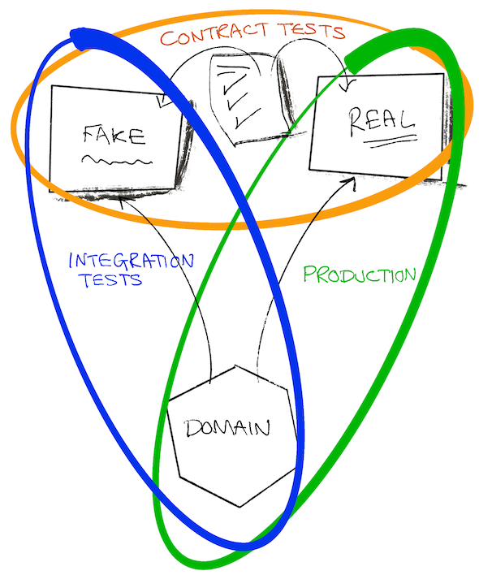

# Работа без mocks

В этой главе мы погрузимся в мир тестовых двойников и рассмотрим, как они влияют на процесс тестирования и разработки. Мы раскроем ограничения традиционных mocks (имитаторы), stubs (заглушки) и spies (шпионы) и представим более эффективный и адаптируемый подход с использованием подделок (**fakes**) и контрактов (**contacts**).

## tl;dr

- Mocks, spies и stubs побуждают вас кодировать предположения о поведении зависимостей ad-hoc в каждом тесте.
- Эти предположения, как правило, не проверяются вручную, что ставит под угрозу полезность вашего тестового набора.
- Подделки и контракты дают нам более устойчивый метод создания тестовых пар с подтвержденными предположениями и лучшим повторным использованием, чем альтернативные варианты.

Эта глава получилась длиннее, чем обычно, поэтому для очистки палитры следует изучить [пример](https://github.com/quii/go-fakes-and-contracts). В частности, обратите внимание на [тест](https://github.com/quii/go-fakes-and-contracts/blob/main/domain/planner/planner_test.go).

---

В разделе [Mocking](https://quii.gitbook.io/learn-go-with-tests/go-fundamentals/mocking) мы узнали, что mocks, stubs и spies являются полезными инструментами для контроля и проверки поведения единиц кода в сочетании с [Dependency Injection](https://quii.gitbook.io/learn-go-with-tests/go-fundamentals/dependency-injection).

Однако по мере роста проекта подобные дубликаты тестов могут стать бременем в обслуживании, и нам следует обратиться к другим идеям проектирования, чтобы сделать нашу систему простой для рассуждений и тестирования.

Подделки и контракты позволяют разработчикам тестировать свои системы на более реалистичных сценариях, улучшать локальный опыт разработки за счет более быстрых и точных контуров обратной связи, а также управлять сложностью развивающихся зависимостей.

### Учебник по тестовым двойникам

Легко закатить глаза, когда такие люди, как я, педантично разбираются в номенклатуре тестовых дублеров, но различия между видами тестовых дублеров помогают нам говорить об этой теме и компромиссах, на которые мы идем, с полной ясностью.

**Test doubles** - это собирательный термин для обозначения различных способов построения зависимостей, которые можно контролировать для тестируемого объекта (**subject under test - SUT**), т.е. объекта, который вы тестируете. Тестовые двойники часто являются лучшей альтернативой использованию реальных зависимостей, поскольку позволяют избежать таких проблем, как

- Необходимость подключения к Интернету для использования API
- Избежать задержек и других проблем с производительностью
- Невозможность отработки случаев с несчастливым путем.
- Отделение своей сборки от сборки другой команды.
  - Вы не захотите предотвращать развертывание, если инженер из другой команды случайно отправит ошибку.

В Go вы обычно моделируете зависимость с помощью интерфейса, а затем реализуете свою версию для управления ее поведением в тесте. **Вот какие виды тестов-двойников рассматриваются в этом посте.**

Дан интерфейс гипотетического API рецепта:

```go
type RecipeBook interface {
	GetRecipes() ([]Recipe, error)
	AddRecipes(...Recipe) error
}
```

В зависимости от того, как мы пытаемся протестировать что-то, использующее `RecipeBook`, мы можем строить тестовые двойники различными способами.

**Заглушки** возвращают одни и те же консервированные данные при каждом вызове

```go
type StubRecipeStore struct {
	recipes []Recipe
	err     error
}

func (s *StubRecipeStore) GetRecipes() ([]Recipe, error) {
	return s.recipes, s.err
}

// AddRecipes omitted for brevity
```

```go
// in test, we can set up the stub to always return specific recipes, or an error
stubStore := &StubRecipeStore{
	recipes: someRecipes,
}
```

**Шпионы** похожи на заглушки, но также записывают, как они были вызваны, поэтому тест может утверждать, что SUT вызывает зависимости определенным образом.

```go
type SpyRecipeStore struct {
	AddCalls [][]Recipe
	err      error
}

func (s *SpyRecipeStore) AddRecipes(r ...Recipe) error {
	s.AddCalls = append(s.AddCalls, r)
	return s.err
}

// GetRecipes omitted for brevity
```

```go
// in test
spyStore := &SpyRecipeStore{}
sut := NewThing(spyStore)
sut.DoStuff()

// now we can check the store had the right recipes added by inspectiong spyStore.AddCalls
```

**Имитаторы** - это как бы надстройка над вышеперечисленными, но они реагируют конкретными данными только на конкретные вызовы. Если SUT вызовет зависимость с неправильными аргументами, то, как правило, произойдет паника.

```go
// set up the mock with expected calls
mockStore := &MockRecipeStore{}
mockStore.WhenCalledWith(someRecipes).Return(someError)

// when the sut uses the dependency, if it doesn't call it with someRecipes, usually mocks will panic
```

**Подделки** - это как бы настоящая версия зависимости, но реализованная способом, более подходящим для быстрого выполнения надежных тестов и локальной разработки. Часто в вашей системе есть некоторая абстракция вокруг персистентности, которая будет реализована с помощью базы данных, но в ваших тестах вместо нее можно использовать подделку in-memory.

```go
type FakeRecipeStore struct {
	recipes []Recipe
}

func (f *FakeRecipeStore) GetRecipes() ([]Recipe, error) {
	return f.recipes, nil
}

func (f *FakeRecipeStore) AddRecipes(r ...Recipe) error {
	f.recipes = append(f.recipes, r...)
	return nil
}
```

Подделки полезны потому, что:

- Их состояние полезно для тестов с несколькими субъектами и вызовами, например, для интеграционных тестов. Управление состоянием с помощью других видов тестовых двойников обычно не рекомендуется.
- Если у них есть разумный API, предложите более естественный способ утверждения состояния. Вместо того чтобы следить за конкретными обращениями к зависимости, можно запросить ее конечное состояние, чтобы узнать, произошел ли нужный вам реальный эффект.
- С их помощью можно запускать приложение локально, не раскручивая и не завися от реальных зависимостей. Это, как правило, повышает удобство работы разработчика, поскольку подделки будут быстрее и надежнее своих реальных аналогов.

Шпионы, имитаторы и заглушки обычно могут быть автоматически сгенерированы из интерфейса с помощью инструмента или с использованием отражения. Однако, поскольку подделки кодируют поведение зависимости, для которой вы пытаетесь создать дубль, вам придется написать, по крайней мере, большую часть реализации самостоятельно.

## Проблема с заглушками и имитаторами

В разделе ["Антипаттерны"](https://quii.gitbook.io/learn-go-with-tests/meta/anti-patterns) подробно рассказывается о том, что использование тестовых дублей должно быть аккуратным. Создать беспорядочный набор тестов легко, если не использовать их со вкусом. Однако по мере роста проекта могут возникнуть и другие проблемы.

Когда вы кодируете поведение в тестовых дублях, вы добавляете в тест свои предположения о том, как работает реальная зависимость. Если между поведением дубля и реальной зависимостью есть расхождения, или они возникают со временем (например, реальная зависимость меняется, чего и следовало ожидать), то тесты могут пройти, а программное обеспечение не сработать.

Заглушки, шпионы и имитаторы, в частности, представляют собой другие проблемы, в основном по мере роста проекта. Чтобы проиллюстрировать это, я опишу проект, над которым я работал.

### Пример из практики

_Некоторые детали изменены по сравнению с тем, что происходило в действительности, и сильно упрощены для краткости. Любое сходство с реальными людьми, живыми или умершими, является чисто случайным._

Я работал над системой, которая должна была вызывать **шесть** различных API, написанных и поддерживаемых другими командами по всему миру. Они были _REST-шными_, и задача нашей системы состояла в том, чтобы создавать и управлять ресурсами в каждом из них. Когда мы правильно вызывали все API для каждой системы, происходило _волшебство_ (бизнес-ценность).

Наше приложение было построено по гексагональной архитектуре (порты и адаптеры). Код нашего домена был отделен от беспорядка внешнего мира, с которым нам приходилось иметь дело. Наши "адаптеры" были, по сути, Go-клиентами, которые инкапсулировали вызов различных API.


### Проблемы

Естественно, при создании системы мы использовали подход, основанный на тестировании. Мы использовали заглушки для имитации последующих ответов API и провели несколько приемочных тестов, чтобы убедиться в том, что все должно работать.

Однако API, к которым нам приходилось обращаться, в большинстве своем были:

- плохо документированы
- выполнялись командами, у которых было много других конфликтующих приоритетов и нагрузок, поэтому было нелегко уделить им время
- часто не имели тестового покрытия, поэтому ломались забавными и неожиданными способами, регрессировали и т.д.
- все еще строились и развивались.

Это приводило к большому количеству неработающих тестов и головной боли. Значительная часть нашего времени уходила на переписку со множеством занятых людей в Slack в попытках получить ответы на вопросы:

- Почему API стал делать `х`?
- Почему API делает что-то другое, когда мы делаем `y`?

Разработка программного обеспечения редко бывает такой простой, как хотелось бы; это обучение. Нам приходилось постоянно узнавать, как работают внешние API. По мере изучения и адаптации мы должны были обновлять и дополнять наш набор тестов, в частности, изменять наши заглушки, чтобы они соответствовали реальному поведению API.

Проблема в том, что это отнимало у нас много времени и приводило к новым ошибкам. Когда ваши знания о зависимости меняются, необходимо найти правильный тест, который нужно обновить, чтобы изменить поведение заглушки, и есть реальный риск не обновить его в других заглушках, представляющих ту же самую зависимость.

### Стратегия тестирования

Кроме того, по мере роста системы и изменения требований мы поняли, что наша стратегия тестирования не подходит. У нас была горстка приемочных тестов, которые давали нам уверенность в работоспособности системы в целом, а затем большое количество модульных тестов для различных пакетов, которые мы писали.

Нам нужно было нечто среднее: мы часто хотели изменить поведение различных частей системы вместе, но при этом не требовалось запускать всю систему для приемочного тестирования. Сами по себе модульные тесты не давали нам уверенности в том, что различные компоненты работают как единое целое; они не могли рассказать (и проверить) историю того, чего мы пытались достичь. Нам нужны были интеграционные тесты.

### Интеграционные тесты

Интеграционные тесты доказывают, что две или более "единицы" работают правильно при их объединении (или интеграции!). Этими единицами может быть как написанный вами код, так и код, интегрированный с чужим кодом, например, с базой данных.

По мере роста проекта вам захочется написать больше интеграционных тестов, чтобы доказать, что большие части вашей системы "работают вместе" - или интегрируются!

Может возникнуть соблазн написать больше приемочных тестов "черного ящика", но они быстро становятся дорогостоящими с точки зрения времени сборки и стоимости сопровождения. Может оказаться слишком дорогостоящим разворачивать всю систему, когда требуется проверить, что только часть системы (а не один модуль) ведет себя так, как должна. Написание дорогостоящих тестов "черного ящика" для каждого элемента функциональности не подходит для больших систем.

### Выход: Подделки

Проблема заключалась в том, что способ тестирования наших модулей зависел от заглушек, которые, по большей части, не имеют состояния (_stateless_). Мы же хотели написать тесты, охватывающие несколько вызовов API с состоянием (_stateful_), где мы можем создать ресурс в начале, а затем отредактировать его.

Ниже представлена урезанная версия теста, который мы хотим сделать.

SUT - это "сервисный слой" (service layer), работающий с запросами "сценариев использования" (use cases). Мы хотим доказать, что если клиент создан, то при изменении его данных мы успешно обновляем ресурсы, созданные в соответствующих API.

Вот требования, предоставленные команде в виде пользовательской истории.

- **Given:** Если пользователь зарегистрирован в API 1, 2 и 3.
- **When:** При изменении номера социального страхования клиента
- **Then:** Затем это изменение распространяется в API 1, 2 и 3.


Тесты, которые охватывают несколько блоков, обычно несовместимы с заглушками, поскольку они не приспособлены для сохранения состояния. Мы можем написать приемочный тест "черного ящика", но затраты на него быстро выйдут из-под контроля.

Кроме того, с помощью "черного ящика" сложно тестировать краевые случаи, поскольку невозможно контролировать зависимости. Например, мы хотели доказать, что механизм отката будет срабатывать при неудаче одного вызова API.

Для этого необходимо было использовать **подделки**. Смоделировав зависимости как stateful API с подделками in-memory, мы смогли написать интеграционные тесты с гораздо более широким охватом, что позволило нам проверить работу реальных сценариев использования, опять же без необходимости раскручивать всю систему, а вместо этого почти с той же скоростью, что и модульные тесты.


Используя подделки, мы можем делать утверждения на основе конечных состояний соответствующих систем, а не полагаться на сложный шпионаж. Мы спрашиваем у каждой подделки, какие записи она хранит для клиента, и утверждаем, что они обновлены. Это выглядит более естественно; если бы мы вручную проверяли нашу систему, то запросили бы эти API, чтобы проверить их состояние, а не проверяли бы журналы запросов на предмет отправки определенной полезной нагрузки JSON.

```go
// take our lego-bricks and assemble the system for the test
fakeAPI1 := fakes.NewAPI1()
fakeAPI2 := fakes.NewAPI2() // etc..
customerService := customer.NewService(fakeAPI1, fakeAPI2, etc...)

// create new customer
newCustomerRequest := NewCustomerReq{
	// ...
}
createdCustomer, err := customerService.New(newCustomerRequest)
assert.NoErr(t, err)

// we can verify all the details are as expected in the various fakes in a natural way, as if they're normal APIs
fakeAPI1Customer := fakeAPI1.Get(createdCustomer.FakeAPI1Details.ID)
assert.Equal(t, fakeAPI1Customer.SocialSecurityNumber, newCustomerRequest.SocialSecurityNumber)

// repeat for the other apis we care about

// update customer
updatedCustomerRequest := NewUpdateReq{SocialSecurityNumber: "123", InternalID: createdCustomer.InternalID}
assert.NoErr(t, customerService.Update(updatedCustomerRequest))

// again we can check the various fakes to see if the state ends up how we want it
updatedFakeAPICustomer := fakeAPI1.Get(createdCustomer.FakeAPI1Details.ID)
assert.Equal(t, updatedFakeAPICustomer.SocialSecurityNumber, updatedCustomerRequest.SocialSecurityNumber)
```

Это проще для написания и легче для чтения, чем проверка различных аргументов вызова функций, передаваемых через шпионов.

Такой подход позволяет нам иметь тесты, которые охватывают широкие части нашей системы, что позволяет нам писать более содержательные тесты, касающиеся тех случаев использования, которые мы обсуждаем на стенде, и при этом выполняются исключительно быстро.

### Подделки дают больше преимуществ инкапсуляции

В приведенном выше примере тесты не интересовались поведением зависимостей, кроме проверки их конечного состояния. Мы создали поддельные версии зависимостей и внедрили их в тестируемую часть системы.

При использовании mocks/stubs нам пришлось бы настраивать каждую зависимость для обработки определенных сценариев, возврата определенных данных и т.д. Это привносит в тесты детали поведения и реализации, ослабляя преимущества инкапсуляции.

Мы моделируем зависимости за интерфейсами, чтобы нам, как клиентам, не нужно было заботиться о том, как это работает, но при "имитационном" подходе нам приходится заботиться об этом в каждом тесте.

### Стоимость обслуживания подделок

Подделки стоят дороже, чем другие двойники тестов, по крайней мере, с точки зрения написанного кода; они должны нести состояние и имитировать поведение того, что они имитируют. Любые расхождения в поведении между подделкой и реальным объектом несут в себе риск того, что ваши тесты не соответствуют реальности. Это приводит к тому, что тесты пройдут, а программное обеспечение будет сломано.

При интеграции с другой системой, будь то API другой команды или база данных, вы будете делать предположения, основанные на ее поведении. Они могут быть получены из документации по API, личных бесед, электронных писем, сообщений в Slack и т.д.

Разве не было бы полезно зафиксировать наши предположения, чтобы проверить их как на нашей подделке, так и на реальной системе, чтобы убедиться в правильности наших знаний повторяемым и документированным способом?

**Контракты** - это средство для достижения этой цели. Они помогли нам управлять предположениями, которые мы сделали в отношении систем другой команды, и сделать их явными. Намного более явными и полезными, чем обмен электронными письмами или бесконечные потоки в Slack!



Наличие контракта позволяет предположить, что мы можем использовать фиктивную и реальную зависимость взаимозаменяемо. Это полезно не только для построения тестов, но и для локальной разработки.

Приведем пример контракта для одного из API, от которого зависит система

```go
type API1Customer struct {
	Name string
	ID   string
}

type API1 interface {
	CreateCustomer(ctx context.Context, name string) (API1Customer, error)
	GetCustomer(ctx context.Context, id string) (API1Customer, error)
	UpdateCustomer(ctx context.Context, id string, name string) error
}

type API1Contract struct {
	NewAPI1 func() API1
}

func (c API1Contract) Test(t *testing.T) {
	t.Run("can create, get and update a customer", func(t *testing.T) {
		var (
			ctx  = context.Background()
			sut  = c.NewAPI1()
			name = "Bob"
		)

		customer, err := sut.CreateCustomer(ctx, name)
		expect.NoErr(t, err)

		got, err := sut.GetCustomer(ctx, customer.ID)
		expect.NoErr(t, err)
		expect.Equal(t, customer, got)

		newName := "Robert"
		expect.NoErr(t, sut.UpdateCustomer(ctx, customer.ID, newName))

		got, err = sut.GetCustomer(ctx, customer.ID)
		expect.NoErr(t, err)
		expect.Equal(t, newName, got.Name)
	})

	// example of strange behaviours we didn't expect
	t.Run("the system will not allow you to add 'Dave' as a customer", func(t *testing.T) {
		var (
			ctx  = context.Background()
			sut  = c.NewAPI1()
			name = "Dave"
		)

		_, err := sut.CreateCustomer(ctx, name)
		expect.Err(t, ErrDaveIsForbidden)
	})
}
```

Как обсуждалось в разделе ["Масштабирование приемочных тестов"](https://quii.gitbook.io/learn-go-with-tests/testing-fundamentals/scaling-acceptance-tests), тестирование на интерфейсе, а не на конкретном типе, делает тест:

- Отделен от деталей реализации
- Может быть повторно использован в различных контекстах.

Это и есть требования к контракту. Это позволяет нам проверить и разработать нашу подделку и протестировать ее в сравнении с реальной реализацией.

Чтобы создать нашу подделку in-memory, мы можем использовать контракт в тесте.

```go
func TestInMemoryAPI1(t *testing.T) {
	API1Contract{NewAPI1: func() API1 {
		return inmemory.NewAPI1()
	}}.Test(t)
}
```

А вот код подделки

```go
func NewAPI1() *API1 {
	return &API1{customers: make(map[string]planner.API1Customer)}
}

type API1 struct {
	i         int
	customers map[string]planner.API1Customer
}

func (a *API1) CreateCustomer(ctx context.Context, name string) (planner.API1Customer, error) {
	if name == "Dave" {
		return planner.API1Customer{}, ErrDaveIsForbidden
	}

	newCustomer := planner.API1Customer{
		Name: name,
		ID:   strconv.Itoa(a.i),
	}
	a.customers[newCustomer.ID] = newCustomer
	a.i++
	return newCustomer, nil
}

func (a *API1) GetCustomer(ctx context.Context, id string) (planner.API1Customer, error) {
	return a.customers[id], nil
}

func (a *API1) UpdateCustomer(ctx context.Context, id string, name string) error {
	customer := a.customers[id]
	customer.Name = name
	a.customers[id] = customer
	return nil
}
```

### Эволюционирующее программное обеспечение

Большинство программных продуктов не создается и не "завершается" навсегда, в одном выпуске.

Это постепенное обучение, адаптация к требованиям заказчика и другим внешним изменениям. В нашем примере API, к которым мы обращались, также развивались и менялись; кроме того, по мере разработки программного обеспечения мы все больше узнавали о том, какую систему нам действительно нужно сделать. Предположения, которые мы делали в наших контрактах, оказывались неверными или становились ошибочными.

К счастью, как только настройка контрактов была сделана, у нас появился простой способ справляться с изменениями. Как только мы узнавали что-то новое, в результате исправления ошибки или сообщения коллеги об изменении API, мы можем:

- Написать тест для отработки нового сценария. Частично это будет связано с изменением контракта, чтобы смоделировать поведение в подделке.
- Запуск теста должен завершиться неудачей, но прежде чем что-либо предпринимать, выполните контракт с реальной зависимостью, чтобы убедиться, что изменения в контракте действительны.
- Обновите подделку, чтобы она соответствовала контракту.
- Сделайте так, чтобы тест прошел.
- Проведите рефакторинг.
- Выполнить все тесты и доставить.

Выполнение полного набора тестов перед проверкой может привести к тому, что другие тесты не пройдут из-за того, что подделка будет вести себя по-другому. Это хорошо! Теперь можно исправить все остальные части системы, зависящие от измененной системы, и быть уверенным, что они также справятся с этим сценарием в производстве. При отсутствии такого подхода пришлось бы вспоминать, как найти все соответствующие тесты и обновить заглушки. Это чревато ошибками, трудоемко и скучно.

### Превосходный опыт разработчиков

Обладая набором подделок с соответствующими контрактами, мы почувствовали себя суперсилой. Мы наконец-то смогли справиться со сложностью API, с которыми нам приходилось иметь дело.

Написание тестов для различных сценариев стало намного проще. Нам больше не нужно было собирать серию заглушек и шпионов для каждого теста; мы могли взять набор модулей (подделок, собственных "сервисов") и очень легко собрать их для отработки различных странных и удивительных сценариев, которые нам были нужны.

Каждый тест с заглушкой, шпионом или иммитатором должен заботиться о том, как ведет себя внешняя система, что обусловлено специальной настройкой. С другой стороны, к подделкам можно относиться как к любой другой хорошо упакованной единице кода, где все детали скрыты от вас, и вы можете просто использовать их.

Мы могли запустить очень реалистичную версию системы локально, и, поскольку вся она находилась в памяти, она запускалась и работала очень быстро. Это означало, что время тестирования было очень быстрым, что было очень впечатляющим, учитывая, насколько полным был набор тестов.

Если наши приемочные тесты не срабатывали в нашей тестовой среде, то первым делом мы запускали наши контракты на API, от которых мы зависели. Часто мы выявляли проблемы раньше, чем это делали разработчики других систем.

### Декораторы не по зубам

Для сценариев ошибок заглушки более удобны, поскольку у вас есть прямой доступ к тому, как она ведет себя в тесте, в то время как подделки имеют тенденцию быть достаточно "черными ящиками". Это намеренный выбор дизайна, поскольку мы хотим, чтобы пользователи (например, тесты) не задумывались о том, как они работают; они должны верить, что они делают правильные вещи благодаря поддержке контракта.

Как сделать так, чтобы подделки не срабатывали, чтобы реализовать опасения по поводу отсутствия счастливого пути?

Существует множество сценариев, когда разработчику необходимо изменить поведение некоторого кода, не меняя его исходного текста. Паттерн декоратора часто является способом взять единицу кода и добавить в нее такие вещи, как протоколирование, телеметрия, повторные попытки и т.д. Мы можем использовать его для обертывания наших подделок, чтобы переопределить поведение, когда это необходимо.

Возвращаясь к примеру с `API1`, мы можем создать тип, который реализует необходимый интерфейс и обертывается вокруг подделки.

```go
type API1Decorator struct {
	delegate           API1
	CreateCustomerFunc func(ctx context.Context, name string) (API1Customer, error)
	GetCustomerFunc    func(ctx context.Context, id string) (API1Customer, error)
	UpdateCustomerFunc func(ctx context.Context, id string, name string) error
}

// assert API1Decorator implements API1
var _ API1 = &API1Decorator{}

func NewAPI1Decorator(delegate API1) *API1Decorator {
	return &API1Decorator{delegate: delegate}
}

func (a *API1Decorator) CreateCustomer(ctx context.Context, name string) (API1Customer, error) {
	if a.CreateCustomerFunc != nil {
		return a.CreateCustomerFunc(ctx, name)
	}
	return a.delegate.CreateCustomer(ctx, name)
}

func (a *API1Decorator) GetCustomer(ctx context.Context, id string) (API1Customer, error) {
	if a.GetCustomerFunc != nil {
		return a.GetCustomerFunc(ctx, id)
	}
	return a.delegate.GetCustomer(ctx, id)
}

func (a *API1Decorator) UpdateCustomer(ctx context.Context, id string, name string) error {
	if a.UpdateCustomerFunc != nil {
		return a.UpdateCustomerFunc(ctx, id, name)
	}
	return a.delegate.UpdateCustomer(ctx, id, name)
}
```

В наших тестах мы можем использовать поле `XXXFunc` для модификации поведения тестового дубля, как это делается при использовании заглушек, шпионов или имитаторов.

```go
failingAPI1 = NewAPI1Decorator(inmemory.NewAPI1())
failingAPI1.UpdateCustomerFunc = func(ctx context.Context, id string, name string) error {
	return errors.New("failed to update customer")
}
```

Однако это неудобно и требует от вас некоторой рассудительности. При таком подходе вы теряете гарантии, предусмотренные контрактом, поскольку вводите в тесты нестандартное поведение.

Лучше всего изучить контекст, и, возможно, вы придете к выводу, что проще было бы проверить конкретные несчастные пути на уровне модульных тестов с помощью заглушки.

### Не является ли этот лишний код пустой тратой времени?

Выдавать желаемое за действительное, полагая, что мы должны писать только тот код, который служит клиентам, и ожидать от него эффективной системы, на которую мы можем опираться. У людей очень искаженное представление о том, что такое расточительство (см. мою заметку: [Призрак Генри Форда разрушает вашу команду разработчиков](https://quii.dev/The_ghost_of_Henry_Ford_is_ruining_your_development_team)).

Автоматизированные тесты не приносят прямой пользы заказчикам, но мы пишем их, чтобы повысить эффективность своей работы (вы же не пишете тесты, чтобы гнаться за показателями покрытия, верно?).

Инженеры должны легко моделировать сценарии (повторяемым образом, а не наобум) для отладки, тестирования и устранения проблем. Подделки in-memory и хорошая модульная конструкция позволяют нам изолировать соответствующих участников сценария, чтобы написать быстрые и подходящие тесты очень дешево. Такая гибкость позволяет разработчикам проводить итерации системы гораздо более эффективно, чем запутанный беспорядок, тестируемый с помощью дорогостоящих в написании и выполнении тестов "черного ящика" или, что еще хуже, ручного тестирования в общей среде.

Это пример соотношения [простоты и легкости](https://habr.com/ru/articles/496802/). Конечно, в краткосрочной перспективе подделки и контракты приведут к написанию большего объема кода, чем заглушки и шпионы, но в долгосрочной перспективе это приведет к созданию более простой и дешевой в обслуживании системы. Обновление шпионов, заглушек и имитаторов по частям трудоемко и чревато ошибками, поскольку у вас не будет соответствующих контрактов для проверки правильности поведения тестовых дублей.

Такой подход требует несколько больших предварительных затрат, но при этом значительно снижает затраты после создания контрактов и подделок. Подделки являются более многоразовыми и надежными, чем специальные тестовые дубликаты, такие как заглушки.

Это очень раскрепощает и придает уверенности, когда вы используете существующую, проверенную в боях подделку, а не создаете заглушку при написании нового теста.

### Как это вписывается в TDD?

Я бы не рекомендовал начинать с контракта: это проектирование "снизу вверх", для которого, как мне кажется, нужно быть более умным, и есть опасность перемудрить с гипотетическими требованиями.

Эта техника совместима с "подходом, основанным на приемочном тестировании", который обсуждался в предыдущих главах, [The Why of TDD](https://quii.dev/The_Why_of_TDD) и в [GOOS](http://www.growing-object-oriented-software.com/)

- Напишите неудачный [приемочный тест](https://quii.gitbook.io/learn-go-with-tests/testing-fundamentals/scaling-acceptance-tests).
- Доработайте достаточное количество кода, чтобы тест прошел, что обычно приводит к созданию некоторого "сервисного слоя", который будет зависеть от API, базы данных или чего-либо еще. Обычно код бизнес-логики отделяется от внешних проблем (таких как персистентность, обращение к базе данных и т.д.) с помощью интерфейса.
- Сначала реализуйте интерфейс с помощью in-memory подделки, чтобы все тесты проходили локально, и проверьте первоначальный дизайн.
- При запуске в производство использовать in-memory нельзя! Зафиксируйте предположения, сделанные в отношении подделки, в контракте.
- Используйте контракт для создания реальной зависимости, например, MySQL-версии хранилища.
- Доставка!

## Где глава о тестировании баз данных?

Это частая просьба, которую я откладывал уже более пяти лет. Причина в том, что эта глава всегда будет моим ответом.

Не издевайтесь над драйвером базы данных и не шпионьте за вызовами. Такие тесты сложно писать, и потенциально они приносят очень мало пользы. Не следует проверять, был ли отправлен в базу данных конкретный SQL-оператор, то есть детали реализации; ваши тесты должны заботиться только о поведении. Доказательство того, что конкретный SQL-оператор был скомпилирован, не доказывает, что ваш код ведет себя так, как вам нужно.

Контракты заставляют вас отделить тесты от деталей реализации и сосредоточиться на поведении.

Следуйте описанному выше подходу TDD, чтобы решить проблему персистентности.

[В репозитории примеров](https://github.com/quii/go-fakes-and-contracts) есть несколько примеров контрактов и их использования для тестирования in-memory и SQLite реализаций некоторых потребностей в персистентности.

```go
package inmemory_test

import (
	"github.com/quii/go-fakes-and-contracts/adapters/driven/persistence/inmemory"
	"github.com/quii/go-fakes-and-contracts/domain/planner"
	"testing"
)

func TestInMemoryPantry(t *testing.T) {
	planner.PantryContract{
		NewPantry: func() planner.Pantry {
			return inmemory.NewPantry()
		},
	}.Test(t)
}
```

```go
package sqlite_test

import (
	"github.com/quii/go-fakes-and-contracts/adapters/driven/persistence/sqlite"
	"github.com/quii/go-fakes-and-contracts/domain/planner"
	"testing"
)

func TestSQLitePantry(t *testing.T) {
	client := sqlite.NewSQLiteClient()
	t.Cleanup(func() {
		if err := client.Close(); err != nil {
			t.Error(err)
		}
	})

	planner.PantryContract{
		NewPantry: func() planner.Pantry {
			return sqlite.NewPantry(client)
		},
	}.Test(t)
}
```

Несмотря на то что Docker и др. упрощают локальное использование баз данных, они все еще могут нести значительную нагрузку на производительность. Подделки с контрактами позволяют ограничить необходимость использования более "тяжелой" зависимости только при проверке контракта, и не использовать ее для других видов тестов.

Использование подделок in-memory для приемочных и интеграционных тестов для остальной части системы позволяет значительно ускорить и упростить работу разработчиков.

## Завершение

Обычно программные проекты организуются таким образом, что различные команды параллельно создают системы для достижения общей цели.

Такой метод работы требует высокой степени взаимодействия и коммуникации. Многие считают, что при подходе "API прежде всего" можно определить некоторые контракты на API (часто на вики-странице!), а затем в течение шести месяцев работать независимо друг от друга и склеить все вместе. На практике это редко работает хорошо, поскольку по мере написания кода мы все лучше понимаем область и проблему, что ставит под сомнение наши предположения. Мы должны реагировать на эти изменения в знаниях, что часто требует изменений в команде.

Поэтому, если вы оказались в подобной ситуации, вам необходимо оптимально структурировать и тестировать свою систему, чтобы справиться с непредсказуемыми изменениями как внутри, так и вне системы, над которой вы работаете.

> "Одной из определяющих характеристик высокоэффективных команд в разработке программного обеспечения является их способность добиваться прогресса и менять свое мнение, не спрашивая разрешения ни у кого из людей или групп, не входящих в их небольшую команду".
>
> Современная программная инженерия - Дэвид Фарли

Не полагайтесь на еженедельные совещания или потоки в Slack для обсуждения изменений. Зафиксируйте свои предположения в контрактах. Проверяйте эти контракты на системах, входящих в конвейер сборки, чтобы быстро получать обратную связь при появлении новой информации. Эти контракты в сочетании с подделками позволят вам работать независимо и устойчиво управлять внешними изменениями.

### Ваша система как набор модулей

Возвращаясь к книге Фарли, я описываю идею **инкрементализма**. Создание программного обеспечения - это постоянное обучение. Понять все требования, которые мы должны решить, чтобы данная система принесла пользу, заранее нереально. Поэтому мы должны оптимизировать наши системы и методы работы, чтобы быстро получать обратную связь и экспериментировать.

Чтобы воспользоваться идеями, обсуждаемыми в этой главе, необходима модульная система. Если у вас есть модульный код с надежными подделками, это позволяет дешево экспериментировать с системой с помощью автоматизированных тестов.

Мы обнаружили, что очень легко превратить странные, гипотетические (но возможные) сценарии в самодостаточные тесты, которые помогают нам понять проблему и создать более надежное программное обеспечение, собирая наши модули вместе и пробуя различные данные в разном порядке, с отказом некоторых API и т.д.

Хорошо определенные, хорошо протестированные модули позволяют наращивать систему, не меняя и не разбираясь во всем сразу.

### Но я работаю над чем-то небольшим со стабильными API

Даже при наличии стабильных API вы не хотите, чтобы ваш опыт разработчика, сборки и т.д. были тесно связаны с чужим кодом. При правильном подходе вы получаете набор модулей, из которых можно собрать систему для производства, запускать локально и писать различные виды тестов с дублями, которым вы доверяете.

Это позволяет изолировать те части системы, которые вас волнуют, и писать содержательные тесты для реальной проблемы, которую вы пытаетесь решить.

### Сделайте свои зависимости первоклассными гражданами

Конечно, заглушки и шпионы имеют свое место. Моделирование различных вариантов поведения зависимостей в тестах всегда будет полезно, но будьте осторожны и не позволяйте затратам выйти из-под контроля.

За свою карьеру я много раз видел, как тщательно написанное талантливыми разработчиками программное обеспечение разваливалось из-за проблем с интеграцией. Интеграция - сложная задача для инженеров, поскольку трудно воспроизвести точное поведение системы, написанной другими инженерами, которые одновременно вносят в нее изменения.

Некоторые команды полагаются на то, что все развертываются в общей среде и тестируют там. Проблема в том, что это не дает изолированной обратной связи, и обратная связь медленная. Вы все равно не сможете проводить различные эксперименты с тем, как ваша система работает с другими зависимостями, по крайней мере, неэффективно.

Мы должны справиться с этой сложностью, используя более сложные способы моделирования зависимостей для быстрого тестирования/экспериментирования на наших машинах разработки до того, как система попадет в производство. Создавайте реалистичные и управляемые подделки зависимостей, подтвержденные контрактами. Тогда вы сможете начать писать более содержательные тесты и экспериментировать с системой, что повысит вероятность успеха.
